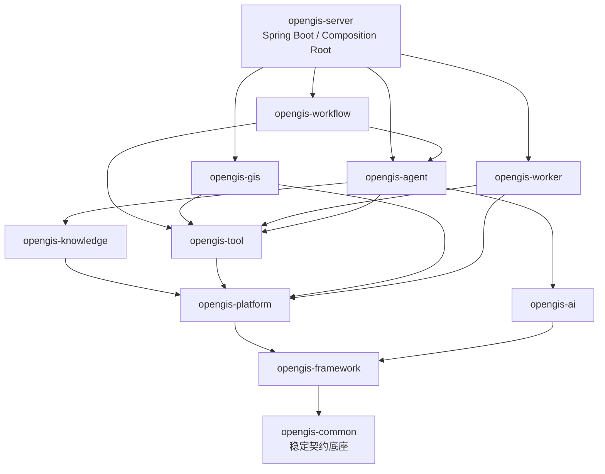

# Phase 1：可学习的 Java 骨架

状态：**完成**

日期：2026-08-02

技术基线：Java 21、Spring Boot 4.1.0、Maven Wrapper 3.9.10、UTF-8

## 学习入口

先阅读 `java-backend/README.md`，再从 `java-backend/pom.xml` 看 Reactor 模块和统一插件，然后阅读 `java-backend/opengis-server` 的 `OpenGisApplication`、`StartupStateMachine`、`OpenGisLifecycle` 和 `HealthController`。其他模块当前只有边界标记类，具体业务将在对应迁移阶段进入，避免 Phase 1 先造空洞框架。



箭头表示“依赖”。`ModuleDependencyTest` 会扫描 `org.opengis` 包并阻止反向依赖；各模块 POM 同时只声明允许的编译依赖。

## 已实现内容

- `java-backend/` 内包含 11 个 Maven 子模块、聚合父 POM、Wrapper 和质量配置；它与 `python-backend/` 并列，现有 Electron/React 保持原目录。
- Wrapper 固定 Maven 3.9.10；Compiler 固定 Java release 21 和 UTF-8。
- Enforcer：Java/Maven 版本、依赖收敛和 release 依赖检查。
- Surefire、Failsafe、JaCoCo、Spotless、Checkstyle、ArchUnit。
- `OpenGisApplication` 兼容 Python Sidecar 的 `--host`、`--port`、`--log-dir` 参数。
- STARTING → INITIALIZING → READY → STOPPING → STOPPED 状态机及失败分支。
- 安全随机进程 token；stdout 保证 token 先于 `OPENGIS_READY`。
- `/api/health` 保持 `{"status":"ok","version":"0.1.0"}` 兼容形状。
- rolling file logging、Spring graceful shutdown 和生命周期集成测试。
- `jdeps` 推导 JDK 模块并由 `jlink` 生成 bundled Java 21 runtime。
- 真实 Electron 30.5.1 主进程启动 bundled Java、解析 stdout 并请求健康接口的冒烟测试。

Phase 1 只预留 WebSocket token，不实现 WebSocket/JSON-RPC；这属于 Phase 2。生产 Electron 仍默认启动 Python，符合绞杀式迁移要求。

## 验收结果

| 验收项 | 结果 |
|---|---|
| 在 `java-backend` 执行 `./mvnw.cmd verify` | 12 个 Reactor project 全部成功 |
| 单元测试 | 6/6 通过 |
| 生命周期集成测试 | 1/1 通过 |
| ArchUnit | 模块依赖规则通过 |
| Spotless / Checkstyle / Enforcer | 通过，0 violation |
| Java 可执行 JAR | 约 19.0 MB |
| jlink runtime | 192 个文件，约 49.3 MiB |
| Electron → bundled Java → health | 通过 |

`jlink` 当前检测到的模块为：`java.base, java.compiler, java.desktop, java.instrument, java.management, java.naming, java.net.http, java.prefs, java.scripting, java.security.jgss, java.sql, jdk.crypto.ec, jdk.jfr, jdk.unsupported, jdk.zipfs`。后续引入 GIS 库后必须重新生成，不能复用旧 runtime。

## 常用命令

```powershell
Push-Location java-backend

# 完整编译、测试、覆盖率、格式、静态和架构检查
./mvnw.cmd verify

# 只验证 Server 及其依赖
./mvnw.cmd -pl opengis-server -am test

# 自动格式化 Java/POM
./mvnw.cmd spotless:apply

# 生成 opengis-server/target/runtime
./opengis-server/scripts/build-runtime.ps1

Pop-Location

# 使用 Electron 主进程和 bundled runtime 启动 Java Sidecar
npm run smoke:java-sidecar
```

构建输出全部位于 `java-backend/opengis-*/target/`，不进入 Git。每个模块根目录的 README 说明职责、允许依赖、推荐包和独立测试命令。

机器可读的本次版本、测试、覆盖率、runtime 大小和 Electron 冒烟结果见 [`verification.json`](verification.json)。
