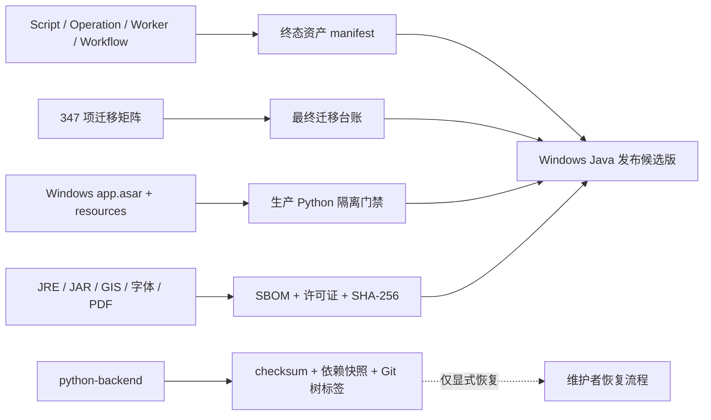

# Phase 10：Java 主运行时与 Python 备份冻结门禁

## 1. 阶段结果

Phase 10 已按用户确认的 Windows-only 范围完成。Windows 桌面包只运行 Java；Python 源码完整保留在仓库中作为可恢复备份，但不会进入安装包、不会被正常启动链导入，也不会在 Java 失败时自动回退。

## 2. 最终资产与迁移台账

- `final-asset-manifest.json`：当前 Windows 用户配置中没有注册的 OpenGIS workspace，因此没有用户 Script/Operation/Worker/Workflow 被静默删除。仓库内 4 个旧 Operation/fixture 和 1 个 Workflow fixture 均进入 `archived` 终态，并记录 Java 替代实现或兼容读取器。
- `migration-ledger-final.json`：从 `migration-matrix.yaml` 固化 347 项，`pending=0`、`unapprovedDeprecated=0`、`productionPythonOnly=0`。
- 终态只允许 `converted`、`archived`、`discarded`。如果以后注册了真实 workspace，发布前必须重新扫描，不能套用本次“0 个注册 workspace”的结论。

## 3. 生产 Python 隔离

门禁同时检查源码配置和构建产物：

- Electron 默认且打包时强制选择 `JavaBackendManager`。
- Renderer 使用 `backendClient` 和 `backend:*` IPC，不再导入 `pythonClient`。
- `resources/` 不含 `python-backend/`。
- `app.asar` 不含开发专用 `pythonManager` chunk。
- 首次启动不创建 venv、不执行 pip；Java 失败只允许重试、打开日志或退出。

`OPENGIS_BACKEND=python` 仅供未打包开发环境的维护者显式对照，不是生产能力。

## 4. SBOM、许可证与校验值

`sbom.cdx.json` 使用 CycloneDX 1.5 结构，记录当前构建中的 Maven runtime JAR、字体文件、jlink JRE、Electron/Chromium PDF 能力和 OpenGIS Server；精确数量由 `windows-runtime-inventory.json` 固定，避免文档数字随依赖升级失真。

每个可读取文件都记录 SHA-256；`windows-runtime-inventory.json` 另行固定 JRE 模块、JRE 目录摘要、Server JAR 摘要及包内存在性。许可证通过当前 POM 和父 POM 递归提取，无法自动识别的组件继续如实标记为 `NOASSERTION`。用户已明确决定不进行人工许可证复核，`license-review-decision.json` 将此项固定为已接受风险、非发布阻断；未知声明不会被伪造成已识别。

`npm-production-audit.json` 固定 `npm audit --omit=dev` 的结果，并由 Phase 10 门禁要求生产依赖漏洞总数为 0。开发/打包工具链依赖不进入这一生产运行时统计。

## 5. 两轮 Windows 候选版验证

| 周期 | 场景 | 启动耗时 | Java 错误 | 结果 |
|---|---|---:|---:|---|
| RC1 | 隔离用户目录首次启动 | 6824 ms | 0 | ready、校验 JAR、正常退出 |
| RC2 | 从 `0.1.0-phase9` 旧 `last-good` 状态启动 | 6767 ms | 0 | ready、升级状态重验、正常退出 |

两轮均运行 `dist/win-unpacked/OpenGIS.exe`，使用 bundled Java 和同一 Server SHA-256。它们是当前 Windows 机器上的两轮候选版证据，不是长期生产环境的两个月或两个正式版本遥测；若要公开发布，仍应在真实用户渠道持续观察。

## 6. Python 备份冻结与恢复

- 标签：`python-backend-phase10-windows-20260803`。
- 标签类型：注释 Git tag，指向只包含 `python-backend/` 的精确 tree snapshot，不依赖当前脏工作区提交。
- 文件校验：`python-backend/SHA256SUMS`，185 个源文件/说明文件。
- 依赖快照：`python-backend/BACKUP_DEPENDENCIES.txt`。
- 元数据：`python-backend/BACKUP_MANIFEST.json`，其中 `deletionForbidden=true`。
- 恢复步骤：`python-backend/RECOVERY.md`。

备份恢复必须由维护者明确执行。正常应用启动、Java RPC 失败或安装包升级均不得自动启用 Python，也不得删除或覆盖用户 workspace。

## 7. 验证命令与结果

2026-08-03 Windows 本机验证：

- `java-backend\\mvnw.cmd --batch-mode verify`：405 tests，0 failure/error/skip。
- `npm run typecheck`：通过。
- `npm test -- --run`：158 tests passed。
- `npm run smoke:java-sidecar`：Agent、Tool、Workflow、GIS、Operation、Java Script、Java Worker、Pivot 全链通过。
- `npm run build:java-runtime`、`npm run build`、`electron-builder --dir`：通过。
- `npm run audit:phase9-package`：Java 资源存在，Python 源码与 Manager 均未打包。
- `npm run audit:phase10`：资产、台账、包内容、备份 checksum/tag、SBOM/JRE/JAR checksum 全部通过。
- `npm audit --omit=dev`：生产依赖 0 项漏洞。
- `npm run smoke:packaged`：两轮 Windows 启动、升级状态重验与优雅退出通过。

自动化入口为 `.github/workflows/phase9-desktop.yml`，当前只使用 `windows-latest`。
