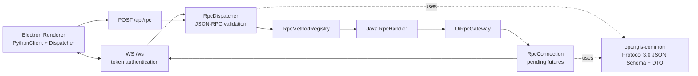
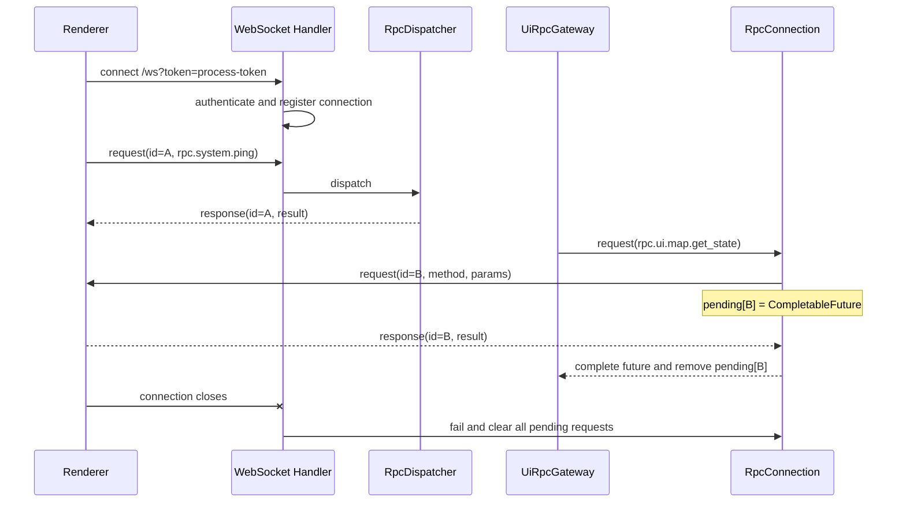

# Phase 2：协议兼容层

状态：**完成**

日期：2026-08-02

范围：共享协议、JSON-RPC、HTTP/WebSocket 传输、双向调用、动态消息合并和 Renderer 兼容验证

## 1. 本阶段解决了什么

Phase 1 只有可启动的 Java Sidecar；Phase 2 为它补齐与现有 Electron Renderer 通信所需的“协议外壳”。此阶段不迁移 Agent、Tool、Workspace 或 GIS 业务实现，只建立后续模块共同使用且可测试的通信底座。

所有 Java 后端实现均位于 `java-backend/`：

- 稳定协议：`java-backend/opengis-common`；
- 网络与调度：`java-backend/opengis-server`；
- `src/` 只增加 Renderer 契约测试，保留原有前端结构。

## 2. 架构与依赖



`RpcDispatcher` 不依赖具体网络，所以 HTTP 与 WebSocket 使用相同的校验、registry 和错误映射。这样可以避免两套传输产生行为差异。

## 3. 共享协议唯一真源

规范文件：

```text
java-backend/opengis-common/src/main/resources/
└─ opengis/protocol/opengis-protocol-3.0.schema.json
```

它冻结以下内容：

- OpenGIS protocol `3.0` 与 JSON-RPC `2.0`；
- request、notification、success response、error response；
- BBox、CRS、8 种 GeometryType；
- 4 种 LayerSource、5 种 LayerStyleType 和 LayerStyle；
- `rpc.`、`chat.`、`event.` 三类消息通道由三端测试共同约束。

对齐门禁：

- Java：`ProtocolSchemaTest`；
- TypeScript：`javaProtocolCompatibility.test.ts`；
- Python：`test_protocol_schema.py`，并且只使用 `python-backend/.venv` 执行。

## 4. JSON-RPC 行为

| 场景 | code / 结果 |
|---|---:|
| JSON 无法解析 | `-32700 Parse error` |
| envelope 非法 | `-32600 Invalid Request` |
| method 不存在 | `-32601 Method not found` |
| params 不是 object/array/null | `-32602 Invalid params` |
| 未捕获异常 | `-32603 Internal error` |
| token 缺失或错误 | `-32001`，发送错误后关闭 WebSocket |
| 已登记但尚未迁移 | `-32004 Capability not migrated` |

notification 没有 `id`，服务端执行后不返回 JSON-RPC response。HTTP notification 使用 204 表达“已接收但无响应体”。

Phase 0 的 47 个 Python 入站方法全部冻结在 `LegacyMethodCatalog`。当前真正实现的协议探针是 `rpc.system.ping`；其余业务方法通过 `-32004` 明确暴露迁移状态，避免 UI 将空对象误判为成功。

## 5. 双向 WebSocket 时序



连接表以 WebSocket session id 隔离。一个 Renderer 的 response 不能完成另一个连接的 pending 请求。

## 6. 动态图层合并

动态图层消息以 `connection + layer_id` 为 key，在 100 ms 内缓冲：

```text
diff(0) → full(1) → diff(2) → diff(3)
                 ↓
发送：full(1) → diff(2) → diff(3)
```

full 是新的完整基线，所以取代它之前的帧；之后的 diff 是相对该基线的增量，任何一条都不能丢失。`DynamicLayerUpdateBufferTest` 固化了这一规则和发送顺序。

## 7. 验收结果

| 验收项 | 结果 |
|---|---|
| Maven Reactor `verify` | 通过，含 Enforcer、Spotless、Checkstyle、JaCoCo、ArchUnit |
| Java 单元与集成测试 | 18/18 通过 |
| HTTP `/api/rpc` ping | 真实 Spring Boot 端口通过 |
| WebSocket token | 正确 token 可连接；错误 token 返回 `-32001` 后关闭 |
| UI → Java request/notification | 真实 WebSocket 集成测试通过 |
| Java → UI request/notification | 真实 WebSocket 集成测试通过 |
| pending 断线清理 | future 失败且连接表归零 |
| 动态 full/diff | 合并和保序测试通过 |
| Renderer mocked handler | 14/14 定向 Vitest 通过 |
| TypeScript typecheck | 通过 |
| Python Schema 对齐 | 1/1，通过隔离 `.venv` 执行 |

机器可读结果见 [`verification.json`](verification.json)。

## 8. 学习与运行命令

```powershell
# Java 全量质量门禁
Push-Location java-backend
./mvnw.cmd verify
Pop-Location

# Renderer 连接、ping、通知与现有路由测试
npm run test:phase2-renderer
npm run typecheck

# Python 只在 Phase 0 建立的隔离环境中运行
python-backend/.venv/Scripts/python.exe -m pytest `
  python-backend/tests/test_protocol_schema.py -q
```

## 9. Phase 3 的接入点

Phase 3 不需要重写传输层。它只需在相应领域模块实现 handler，并由 `opengis-server` 组合注册到 `RpcMethodRegistry`，将对应方法从 `-32004` 占位替换为真实结果即可。
