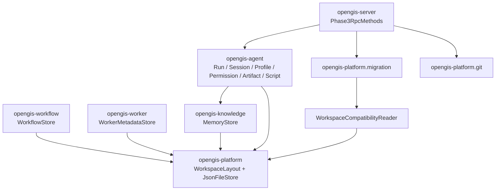
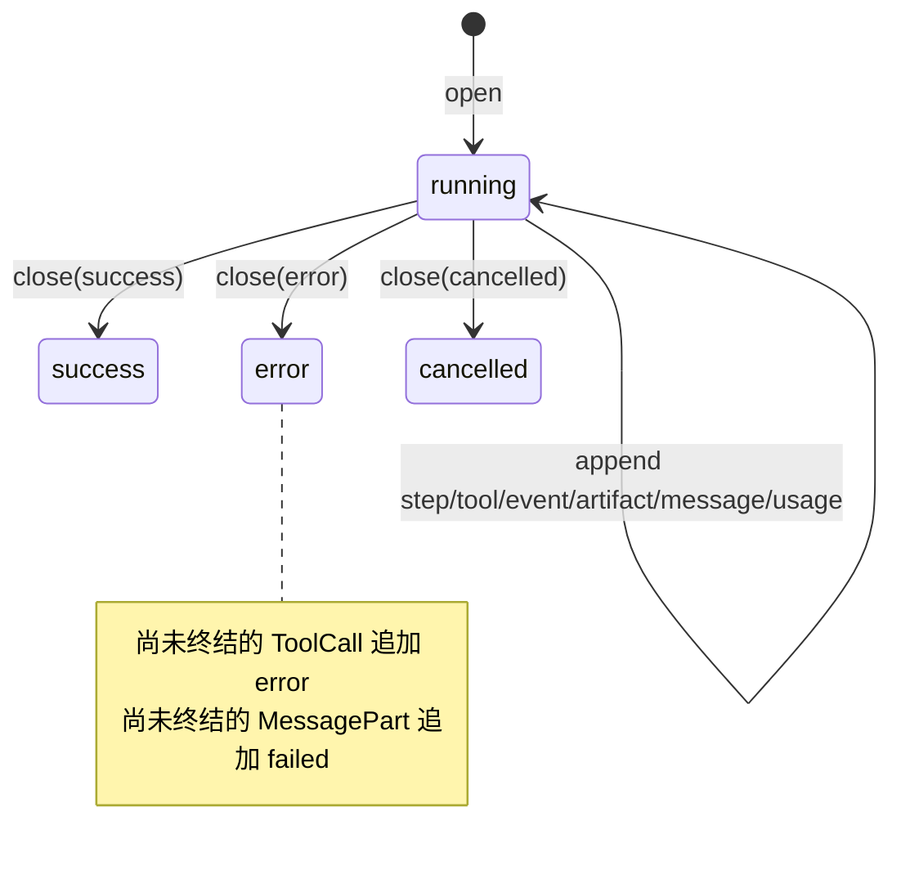
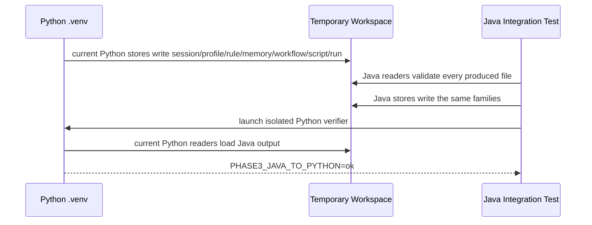

# Phase 3：数据与工作区

状态：**完成**

日期：2026-08-02

范围：旧数据只读验证、兼容 Writer、RunArchive、领域存储、Electron 数据、Git 和 migration manifest

## 1. 设计原则

本阶段遵循“先证明能读，再允许写”：

1. `WorkspaceCompatibilityReader` 只读扫描 Phase 0 的匿名 workspace fixture；
2. 15 类持久化 family 全部可解析后，启用各领域 Writer；
3. Writer 永远在临时 workspace 测试，不修改黄金 fixture；
4. Python Writer → Java Reader、Java Writer → Python Reader 双向通过后，才启用 Phase 3 RPC；
5. migration apply 不重写旧业务文件，只增加可回滚的 Java compatibility marker 和审计 manifest。

## 2. 模块架构



所有 Java 后端文件仍位于 `java-backend/`。只有 Electron 自己拥有的 `settings.json/projects.json` Reader 保留在现有 `electron/` 目录，并同步增加 Java backend 字段。

## 3. Phase 0 数据覆盖

| family | Java Reader/Writer | 所属模块 | 结论 |
|---|---|---|---|
| sessions-and-inbox | `SessionStore` | agent | 兼容 |
| agent-profiles | `AgentProfileStore` | agent | 兼容并合并 5 个默认 Profile |
| permissions | `PermissionRuleStore` | agent | 兼容 |
| conversation-context | `ContextStore` | agent | 兼容 |
| titled-conversations | `ConversationTitleStore` | agent | 保持 conversation id 数组格式 |
| artifact-index | `ArtifactStore` | agent | append-only JSONL |
| structured-memory | `MemoryStore` | knowledge | 4 类 JSONL |
| legacy-memory | `MemoryStore` | knowledge | 保留 memory.md |
| workflows | `WorkflowStore` | workflow | `.flow.json` |
| workflow-step-output | `WorkflowStore` | workflow | Markdown |
| run-archive | `RunArchive` | agent | meta + 6 条 JSONL stream |
| workspace-operations | compatibility reader | platform | 本阶段只读；执行迁移在 Tool/GIS Phase |
| operation-runs | compatibility reader | platform | 本阶段只读 |
| skill-sources | compatibility reader | platform | 本阶段只读 |
| workspace-skills | compatibility reader | platform | 本阶段只读 |
| raster-cache | 不 round-trip | GIS | 可再生缓存 |

缺失的 store family 被视为“合法空 store”；存在但 JSON/JSONL 损坏才会阻止 migration apply。因此新建或使用较少功能的旧 workspace 也可以迁移。

## 4. 文件安全与 Writer

`WorkspaceLayout` 将所有 `.opengis` 路径约束在已规范化的 workspace root 内，拒绝绝对路径和 `..` 穿越。

`JsonFileStore` 规则：

- 编码固定 UTF-8；
- 可变 JSON snapshot 先写同目录临时文件，再使用 atomic move 替换；
- JSONL 只追加，不覆盖历史；
- JSONL 每行必须是 object，错误包含文件和行上下文；
- Java 不在原地改写 Phase 0 fixture。

## 5. RunArchive

```text
.opengis/runs/<run_id>/
├─ meta.json
├─ steps.jsonl
├─ tool_calls.jsonl
├─ artifacts.jsonl
├─ events.jsonl
├─ message_parts.jsonl
├─ llm_usage.jsonl
└─ final_answer.md
```

生命周期：



修复采用追加终态事件，不删除 running 历史，因此 Python 和 Java 都可以审计完整过程。`RunArchive.load/list` 可直接读取 Phase 0 的旧 run。

## 6. Python 与 Java 双向兼容



Python 只通过 `python-backend/.venv/Scripts/python.exe` 启动，没有使用系统 Python。

## 7. Electron 数据升级

Electron 与 Java 的 Reader 都兼容无版本旧文件。升级后的新增字段：

```json
{
  "schemaVersion": 2,
  "backend": {
    "preferredRuntime": "java",
    "fallbackRuntime": "python",
    "protocolVersion": "3.0"
  }
}
```

`projects.json` 增加 `schemaVersion=2` 与 `backend.javaCompatible=true`。旧字段、未知插件字段和 project 条目原样保留；默认值采用深合并补齐。

## 8. Git snapshot/revert

`GitWorkspaceAdapter` 使用 `ProcessBuilder`，所有命令把 workspace 设为 cwd：

- snapshot：`git add -A` + 带 OpenGIS identity 的 allow-empty commit；
- head：返回短 SHA；
- revert：仅显式调用时执行 `git reset --hard <sha>`；
- Git 不可启动时抛出 `GitNotAvailableException`；非零退出抛出 `GitCommandException`。

测试只在 JUnit 临时 Git 仓库中执行 reset，不触碰用户 workspace。

## 9. Migration manifest

`WorkspaceMigrationService` 提供：

- `inspect`：只读扫描、列出损坏 family，判断 marker；
- `apply`：为旧文件生成 path/bytes/SHA-256 清单，写入 manifest 和 Java marker；
- 重复 `apply`：返回相同 migration id，不重复迁移；
- `rollback`：移除 Java marker，将 manifest 状态改为 `rolled_back`，保留审计记录。

文件：

```text
.opengis/java-backend.json
.opengis/migrations/manifest.json
```

因为 apply 不修改旧业务文件，rollback 不需要用备份覆盖用户数据；测试会比较 apply/rollback 前后的 `sessions.json` 原始字节。

## 10. 已启用 RPC

以下方法已从 Phase 2 的 `-32004` 占位替换为真实持久化实现：

- `rpc.agent.sessions.list`
- `rpc.agent.inbox.list`
- `rpc.agent.profiles.list`
- `rpc.agent.artifacts.list`
- `rpc.agent.permissions.rules.list/add/remove`
- `rpc.runs.list/get`
- `rpc.workspace.revert_run`
- `rpc.migration.inspect/apply/rollback`

所有方法继续经过 Phase 2 的同一个 `RpcDispatcher`，错误参数返回 `-32602`。

## 11. 验收结果

| 验收项 | 结果 |
|---|---|
| Phase 0 fixture | 15/15 持久化 family 可读，raster cache 正确排除 |
| Java 测试 | 26/26 通过 |
| Python Writer → Java Reader | 通过 |
| Java Writer → Python Reader | 通过 |
| RunArchive 异常终态修复 | 通过 |
| Electron legacy deep merge | 通过 |
| Git snapshot/revert/缺失错误 | 通过 |
| migration inspect/apply/idempotent/rollback | 通过 |
| sparse workspace migration | 通过 |
| TypeScript typecheck | 通过 |
| Maven 质量门禁 | Enforcer、Surefire、Failsafe、JaCoCo、Spotless、Checkstyle、ArchUnit 全通过 |

机器可读结果见 [`verification.json`](verification.json)。

## 12. 常用命令

```powershell
Push-Location java-backend
./mvnw.cmd verify
Pop-Location

npm run typecheck

# Python 只使用隔离环境
python-backend/.venv/Scripts/python.exe -m pytest `
  python-backend/tests/test_protocol_schema.py -q
```
