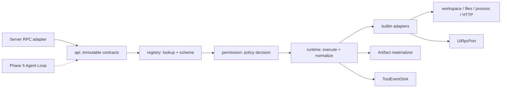
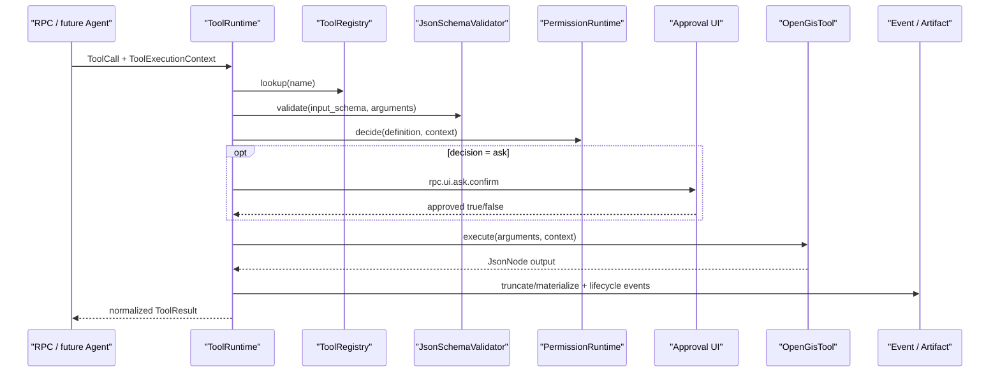

# Phase 4：统一工具运行时

## 1. 阶段结论

Phase 4 已把 Python 中分散的工具注册、参数处理、权限判断、UI 回调和输出处理，迁移为 Java 的单一受控流水线。Java 目前激活 **62 个与 Python 同名的工具**；其余 **27 个**需要 Phase 5～8 的 Agent、Workflow、GIS、Operation 或 Worker 引擎，已明确归属且不向生产目录注册，因此不会出现“返回成功但什么也没做”的占位行为。

本阶段完成的 RPC：

- `rpc.tool.list`：返回兼容 `ToolSchema.to_dict()` 的 snake_case 目录，并附带标准 `input_schema` 与风险等级。
- `rpc.tool.execute`：执行统一流水线，兼容 Python 的 `success/data/error/geojson/chart_config` 字段，并增加结构化状态、Artifact 和错误详情。
- `rpc.fs.load_file`、`rpc.fs.get_file_info`：替换 Phase 2 占位实现，强制 workspace 边界。

## 2. 可学习的五层架构



推荐按以下文件顺序学习：

1. `ToolDefinition`：工具是什么、参数 Schema、风险、分组。
2. `ToolExecutionContext`：workspace、run、profile、取消、事件和 UI 端口怎样显式传递。
3. `ToolRegistry` 与 `JsonSchemaValidator`：如何在执行前拒绝重复定义和非法参数。
4. `PermissionRuntime`：为什么任何有副作用的适配器都不能自己决定权限。
5. `ToolRuntime`：唯一执行流水线以及结果如何统一。
6. `BuiltinToolCatalog`：Server 如何按风险顺序组装实际工具。

`opengis-tool` 不依赖 Spring、Agent、GIS、Workflow、Worker 或 Server。Spring Bean、WebSocket connection id 和兼容 RPC 投影都在 `opengis-server`，从而保持领域运行时可独立测试。

Renderer-backed 工具采用两层校验：Java JSON Schema 先验证 object、关键标识字段及其基本类型；转发后的 canonical `rpc.ui.map.*` / `rpc.ui.layout.*` 再由现有 Zod Schema 校验完整样式、布局和地图参数。Java 适配器负责 Python 参数到 canonical payload 的转换，例如 `lng/lat → center`、分级/分类/拉伸参数 → `set_layer_renderer`、栅格平铺参数 → `raster`。这避免在两端维护两份会漂移的完整 Renderer Schema，同时确保权限判断前已经拒绝缺失的关键标识。

## 3. 固定执行流水线



生命周期事件至少包含：`tool.started`、`tool.permission_decided`、`tool.artifact`（适用时）、`tool.completed`、`tool.failed` 或 `tool.cancelled`。传入存在的 `run_id` 时，Server 将事件追加到 Phase 3 的 `events.jsonl`。

## 4. 权限模型

权限优先级严格固定：

1. `.opengis/permissions.json` 中最后匹配的持久化规则；支持 `*`、`?` 和 `profile_name`。
2. 当前执行上下文的 Profile tool override。
3. 工具风险：破坏性操作为 `ASK`，写入和网络为 `ASK`。
4. Profile 默认动作。

`ASK` 使用已有 Renderer 方法 `rpc.ui.ask.confirm`。没有 WebSocket UI、超时、用户拒绝或连接断开时默认失败；Executor 不会先运行。HTTP RPC 可直接执行只读工具；有副作用工具需要持久化 `ALLOW` 规则，或从带审批 UI 的 WebSocket 调用。

## 5. 输出、Artifact 与错误

- 默认序列化输出上限为 32,000 字符。
- 超限完整 JSON 写到 `.opengis/runs/{safe_run_id}/artifacts/{uuid}.txt`。
- `ArtifactRef` 记录相对路径、媒体类型、字节数和 SHA-256。
- 主输出保留截断摘要和 `artifact_id`，避免阻塞 Renderer 或污染 LLM 上下文。
- 错误使用稳定 code，例如 `invalid_arguments`、`permission_denied`、`permission_rejected`、`tool_cancelled`、`workspace_boundary`、`process_timeout`。

## 6. 已激活工具（62）

| 顺序 | 数量 | 工具 |
|---|---:|---|
| 文件只读 | 5 | `read_file`、`list_directory`、`file_exists`、`glob`、`grep` |
| 文件写入 | 6 | `write_file`、`edit_file`、`create_directory`、`copy_file`、`move_file`、`delete_file` |
| Shell / Web | 2 | `bash`、`webfetch` |
| UI map / layout / plot | 38 | 地图图层、相机、底图、样式、栅格显示、布局编辑/导出、`interactive_snapshot`、`save_plot` 的 canonical Renderer RPC 适配器 |
| Report / Academic / Debug / Script / Skill | 10 | `write_report_section`、5 个学术指令工具、`debug_agent_context`、`list_scripts`、`read_script`、`load_skill` |
| GIS 边缘转换 | 1 | `csv_to_geojson`（UTF-8 点 CSV、引号字段、WGS84 GeoJSON） |

完整逐项状态见 [工具迁移台账](tool-migration-ledger.md)。

### Shell 的兼容性收紧

Python `bash` 接收整条 `command` 字符串；Java 定义升级为必填 `argv: string[]`。这是有意的安全变更：`ProcessBuilder` 直接执行参数，不使用 `cmd /c`、`sh -c` 或字符串拼接。旧调用在 Java 模式会得到 `invalid_arguments`，Provider 投影在 Phase 5 应生成 `argv`。

### GIS 的阶段边界

Phase 4 只激活不依赖 GeoTools/GDAL 的 `csv_to_geojson` 和 Renderer 栅格显示端口。Shapefile/GPKG/KML、CRS、几何算法、Raster tile、OSM/QGIS/datasource 的数值与网络实现仍属于 Phase 7，不能用简单 JSON 转发冒充已迁移。

## 7. 路径、网络和进程安全

- 相对路径以 workspace 为根；绝对路径也必须仍位于 workspace。
- 规范化后检查前缀，并检查最近已存在祖先的真实路径，阻止符号链接逃逸。
- `write_file` 覆盖现有文件必须显式 `overwrite=true`；`edit_file` 要求精确找到旧文本。
- `delete_file`、`move_file` 属于破坏性风险，必须审批。
- `webfetch` 只允许 HTTP/HTTPS，限制连接/请求超时并使用有界重定向。
- Shell 使用 argv、显式 workdir、最长 10 分钟；超时/取消时清理整个 `ProcessHandle` 后代树。

## 8. 五类测试如何覆盖每个 Tool

`ToolRuntimeContractTest` 对 62 个生产 `ToolDefinition` 分别参数化运行五个场景，因此形成至少 **310 个逐工具契约用例**：

1. 合法参数成功并规范化为 `COMPLETED`。
2. 非 object 参数被 JSON Schema 拒绝。
3. Profile override 为 `DENY` 时 Executor 不运行。
4. 预先取消时返回 `CANCELLED`。
5. Executor 抛异常时归一化为结构化 `tool_execution_failed`。

`BuiltinToolIntegrationTest` 再使用真实适配器验证文件读写/编辑、越界拒绝、审批前无副作用、持久化允许规则、argv Shell、UI RPC、学术指令、报告写入、带引号 CSV 转 GeoJSON、输出截断与 Artifact/事件。

跨语言测试 `Phase4PythonInteropIT` 只使用 `python-backend/.venv` 加载当前 Python 注册表，核对 Java 的 62 个名称、snake_case 目录、params 和 JSON Schema 一致性。

## 9. 验证命令

```powershell
cd java-backend
./mvnw.cmd spotless:apply
./mvnw.cmd verify

cd ..
npm run typecheck
npm run test:phase4-renderer
python-backend/.venv/Scripts/python.exe -m pytest python-backend/tests/test_protocol_schema.py -q
npm run smoke:java-sidecar
```

实际结果记录在 [verification.json](verification.json)。
