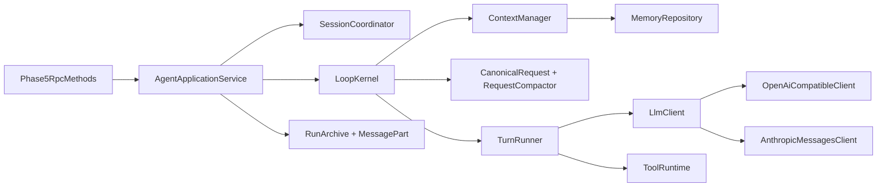

# Phase 5：LLM 与 Agent 主循环迁移说明

> 状态：Java 实现与确定性契约测试完成
>
> 日期：2026-08-02
>
> 工程根目录：`java-backend/`

## 1. 本阶段交付结果

Phase 5 已把 Python 侧 LLM/Agent 的主执行路径迁入 Java，并保持“协议适配、知识、Agent 编排、服务器传输”四层分离：

- `opengis-ai`：provider-neutral request/message/chunk/tool-call/usage/error，OpenAI-compatible 与 Anthropic Messages SSE 适配器，完整请求预算、稳定前缀、压缩和缓存观测。
- `opengis-knowledge`：结构化 Memory、旧 `memory.md` 兼容读取、FailureMemory、WorkingState、KnowledgeExtractor。
- `opengis-agent`：AgentProfile、ContextManager、SessionCoordinator、TurnRunner、LoopKernel、RetryPolicy、RuntimeControl、Tool schema 投影。
- `opengis-server`：LLM 配置、连接测试、异步 chat、interrupt/status、Provider 目录、Cache Observatory RPC、MessagePart/RunArchive 投影，以及 WebSocket 断开取消。

Java 后端不会持久化 API key；Provider 配置只保存在当前 Sidecar 进程内，安全响应只暴露 `has_api_key`。

## 2. 学习用架构图



依赖方向的关键点：

1. `opengis-knowledge` 不认识 Provider，也不依赖 `opengis-ai`。
2. `ContextManager` 放在 `opengis-agent`，因为“把知识、历史和 Tool schema 组装成一次 LLM 请求”属于编排职责。
3. `TurnRunner` 只执行“一次 Provider turn + 本轮 Tool settlement”；循环和停止策略由 `LoopKernel`、`RuntimeControl` 决定。
4. 所有 Tool 仍只经 Phase 4 的 `ToolRuntime` 执行，没有出现第二套权限或工具执行通道。

## 3. 一次聊天请求如何运行

```mermaid
sequenceDiagram
    participant UI as Renderer
    participant RPC as Phase5RpcMethods
    participant APP as AgentApplicationService
    participant LOOP as LoopKernel
    participant LLM as LlmClient
    participant TOOL as ToolRuntime

    UI->>RPC: chat.user_message
    RPC->>APP: start(ChatCommand)
    APP-->>UI: status=started, run_id
    APP->>LOOP: virtual thread 中运行
    LOOP->>LLM: canonical LlmRequest + cancellation
    LLM-->>UI: text/tool chunks -> chat.message_part
    alt 模型返回 tool call
        LOOP->>TOOL: ToolCall + ToolExecutionContext
        TOOL-->>LOOP: ToolResult
        LOOP->>LLM: assistant tool_call + tool result
    else 模型返回最终文本
        LOOP-->>APP: completed
        APP-->>UI: text completed + turn stream_end
    end
```

`chat.user_message` 返回“已启动”而不占住 WebSocket 收包线程，因此同一连接可以继续发送 `rpc.agent.interrupt`。真正的完成由 `chat.message_part` 的 `turn/stream_end` 或 `chat.cancelled` 表示，与现有 Renderer 状态机一致。

## 4. Provider 设计

Phase 0 冻结的 24 个公开 Provider 全部保留，没有静默删除：

- OpenAI-compatible：OpenAI、DeepSeek、Mistral、Google Gemini OpenAI endpoint、xAI、Ollama、OpenRouter、Cohere、Azure OpenAI、Baidu、Zhipu、Hunyuan、Qwen、Doubao、Kimi、StepFun、Yi、SiliconFlow、Xiaomi MiMo、Perplexity、NVIDIA NIM、Hugging Face。
- Anthropic Messages-compatible：Anthropic、MiniMax。

两类协议共用 `LlmRequest`、`LlmChunk`、`LlmUsage` 与 `LlmError`，Provider JSON 只能在 `ProviderProjector` 内产生。OpenAI-compatible 支持流式文本、增量 tool arguments、usage/cache token；Anthropic 支持 `text_delta`、`tool_use`、`input_json_delta` 和 cache read/create token。

Azure 使用 `api-key` 请求头，并允许用户提供带 `api-version` 查询参数的完整 deployment URL。Phase 0 标为 `tier-2-certification` 或 `compatibility-spike` 的厂商仍需在发布前使用真实账号做外部连通认证；这不在离线 CI 中伪造成功。

完整逐项台账见 [Provider 迁移矩阵](provider-matrix.md)。

## 5. Canonical request 与缓存

请求固定按以下顺序组装：

```text
system
-> capability_manifest
-> tool_protocol
-> user_preferences
-> conversation_summary
-> memory
-> working_state
-> append-only history
-> tool_observation
-> runtime tail
```

- 前四段形成可缓存稳定前缀；Anthropic 投影会在稳定 system block 写入 ephemeral cache breakpoint。
- `RequestBudget` 同时计算 messages、完整 Tool JSON Schema 和输出预留，不能只计算聊天文本。
- `RequestCompactor` 只压缩旧 history，保持稳定前缀与 Tool schema 不变。
- `CacheObservatory` 只保存 hash、计数和 token 用量，不保存 prompt 内容或 API key；可通过 `rpc.agent.cache.stats` 查看。

## 6. 停止、重试与取消

| 场景 | Java 行为 | 终态 |
|---|---|---|
| 用户 interrupt | 同一 `CancellationToken` 传入 LLM 和 Tool | `cancelled` |
| WebSocket 断开 | 按 `connection_id` 取消该连接拥有的 run | `cancelled` |
| Provider 超时 | 关闭 HTTP future/response stream，不无限等待 | `provider_timeout` |
| Tool 卡住 | 虚拟线程 Future 超时并 interrupt，取消整个 run | `tool_timeout` |
| 可重试网络错误 | `RetryPolicy` 最多两次、短指数退避 | 成功或 provider error |
| 同一 Tool 失败三次 | `FailureMemory` 归一化签名并熔断 | `repeated_failure` |
| 模型承诺“下一步”却不调用 Tool | 只允许一次 runtime nudge | `deviation` |
| Provider/Tool 步数上限 | `RuntimeControl` 在执行前检查 | `step_limit` |

网络重试和 Tool 失败后的新推理是两件事：前者由 `RetryPolicy` 处理，后者作为结构化 ToolResult 返回下一轮模型，不会叠加成请求风暴。

## 7. RPC 与数据兼容

本阶段激活或新增：

- `rpc.agent.set_llm_config`
- `rpc.agent.test_connection`
- `rpc.agent.providers.list`
- `rpc.agent.cache.stats`
- `rpc.agent.get_status`
- `rpc.agent.profiles.install_defaults`
- `rpc.agent.interrupt`
- `chat.user_message`

运行继续写入：

- `.opengis/runs/<run_id>/meta.json`
- `events.jsonl`
- `tool_calls.jsonl`
- `message_parts.jsonl`
- `llm_usage.jsonl`
- `final_answer.md`
- `.opengis/sessions.json`
- `.opengis/contexts/<conversation_id>.json`
- `.opengis/memory/records.json`

旧 `.opengis/memory.md` 以只读来源继续进入相关记忆投影。

## 8. 验证范围

确定性测试覆盖：

- OpenAI-compatible 和 Anthropic 本地 SSE 服务器连接、请求投影、文本、Tool delta、usage/cache usage。
- Azure header、deployment path 与 `api-version` query。
- Provider timeout、流中取消、WebSocket connection ownership。
- 完整请求预算、stable prefix、history compaction、Cache Observatory。
- function-call -> ToolRuntime -> 下一 Provider turn -> final answer。
- 重复失败、偏离、Tool 卡住、interrupt、RunArchive 与 Session 状态。
- Java ProviderCatalog 与 Phase 0 Python 台账的 24 项跨语言对照；Python 只通过 `python-backend/.venv` 运行。

验证命令：

```powershell
cd java-backend
.\mvnw.cmd -q verify

cd ..
npm run typecheck
npm run test:phase5-renderer
python-backend\.venv\Scripts\python.exe -m pytest python-backend\tests\test_protocol_schema.py -q
```

真实厂商连接不进入无密钥 CI。发布候选版本按 Provider 矩阵的 support tier 使用专用测试账号运行 `npm run certify:provider`；凭据只从 `OPENGIS_CERT_API_KEY` 读取并停留在进程内，证据只记录 Provider、协议、模型、endpoint/region、延迟和认证结果，不写入密钥。无真实凭据时该项保持未认证，不能伪造通过。
