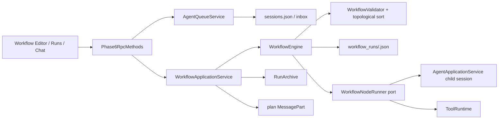
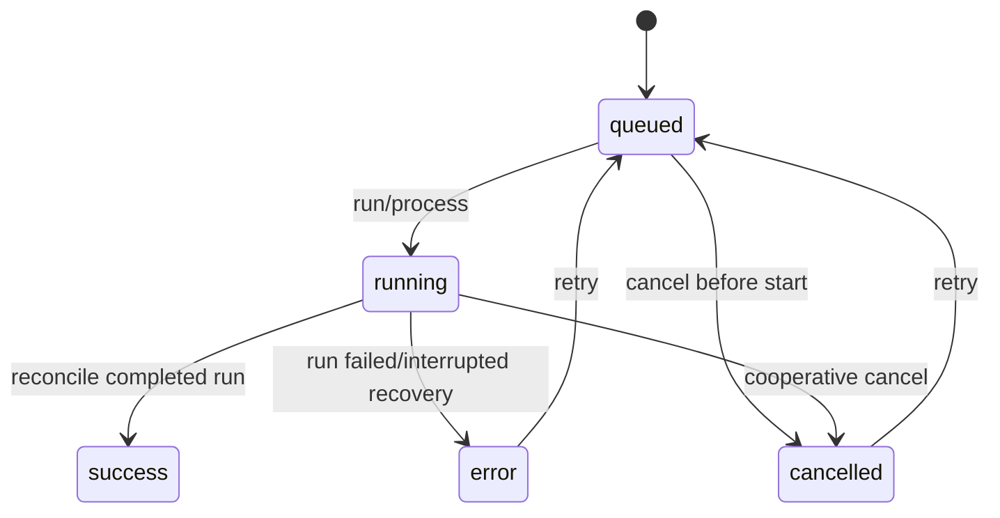

# Phase 6：Workflow 与恢复迁移说明

> 状态：Java 实现、兼容 RPC、前端 v2 编辑器与确定性测试完成
>
> 日期：2026-08-02
>
> 代码根目录：`java-backend/`

## 1. 本阶段交付结果

Phase 6 将 Python 的内存 Queue 与提示词式 Workflow，迁移成 Java 的持久化控制面和可恢复 DAG 执行器：

- `opengis-workflow/model`：Workflow schema v2 的纯数据模型。
- `opengis-workflow/validation`：DAG、执行引用、路径、规模限制和安全 JSON 条件校验。
- `opengis-workflow/migration`：v1 `inspect / convert / manual_required` 报告。
- `opengis-workflow/execution`：拓扑执行、child session、节点重试、取消、恢复和副作用去重。
- `opengis-workflow/queue`：持久化 Queue 状态机以及 submit/run/get/list/resume/retry/cancel/process。
- `opengis-server/workflow`：Agent child session、ToolRuntime、RunArchive 和 MessagePart 的适配层。
- `src/features/workflows`：Workflow Editor 已切到 schema v2，不再生成 Python script 或 Python Hook。

## 2. 学习用架构图



边界的关键点：

1. `opengis-workflow` 不依赖 Spring、WebSocket 或 Renderer；它只定义模型、状态机和端口。
2. `opengis-server` 是组合根，负责把节点端口接到 Agent 与 ToolRuntime。
3. Queue 复用 `.opengis/sessions.json` 的 `inbox`，因此现有 Runs 控制面可以继续读取。
4. Workflow 运行状态独立写入 `.opengis/workflow_runs/<run_id>.json`；顶层运行同时写 RunArchive，供 Runs UI 使用。

## 3. Workflow schema v2

每个节点必须声明结构化执行引用：

可直接学习和复制的完整模板见 [`templates/gis-agent-workflow-v2.flow.json`](templates/gis-agent-workflow-v2.flow.json)。

```json
{
  "schemaVersion": 2,
  "id": "buffer-analysis",
  "name": "Buffer analysis",
  "nodes": [
    {
      "id": "inspect",
      "title": "Inspect source data",
      "type": "agent_task",
      "execution": { "kind": "agent_task", "ref": "gis-build" },
      "inputs": [],
      "outputs": [{ "name": "summary", "type": "object" }],
      "params": {},
      "position": { "x": 0, "y": 0 },
      "conditions": [
        {
          "expression": { "exists": { "var": "output.answer" } },
          "onFalse": "fail"
        }
      ],
      "retryPolicy": { "maxAttempts": 2, "backoffMs": 250 }
    }
  ],
  "edges": []
}
```

`type` 与 `execution.kind` 必须一致。v2 允许以下引用：

| 类型 | `ref` 含义 | Phase 6 执行状态 |
|---|---|---|
| `agent_task` | Agent profile 名称 | 已执行；每个节点使用稳定 child session id |
| `tool_call` | ToolRegistry 工具名 | 已执行；仍经过 schema、权限、Artifact 和取消链路 |
| `operation` | Operation id | Phase 8A 真实执行器已接入 |
| `java_script` | 工作区相对 `.java` 文件 | Phase 8B 真实执行器已接入 |
| `subworkflow` | Workflow id | 真实递归执行器已接入；独立 run、取消传播、深度与循环保护 |

未接入的节点类型会明确失败为 `executor unavailable`，不会伪造成成功。

## 4. 安全条件 DSL

v1 的 Hook 是任意 Python 表达式，不能进入 Java-only 的安全边界。v2 只接受有界 JSON Logic 子集：

- 数据访问：`var`、`exists`
- 比较：`==`、`!=`、`>`、`>=`、`<`、`<=`
- 逻辑：`and`、`or`、`!`
- 包含：`in`

求值器限制最大深度 16、最多 256 个表达式节点；它不能调用方法、读取文件、反射或执行 Python/JavaScript/SpEL。`onFalse` 可以是 `fail`、`retry` 或 `skip`。

## 5. 恢复与幂等语义



Workflow 节点恢复采用以下规则：

1. 节点开始前计算 `SHA-256(node definition + mapped predecessor inputs)`。
2. 恢复时，若节点已完成且输入指纹未变，直接跳过，不重复执行。
3. Edge 使用 `sourceHandle -> targetHandle` 做显式输出映射；未命名端口才回退到前驱节点 id。
4. 节点失败但尚未提交副作用时，可以按 `retryPolicy` 重试。
5. 节点标记 `sideEffectCommitted=true` 后失败，自动恢复立即停止并要求人工处理，防止重复写文件或重复添加图层。
6. Queue 可选 `metadata.idempotency_key`；相同 key 和相同命令返回原 queue item，不重复入队。

## 6. v1 迁移规则

`rpc.workflow.inspect` 只检查，不写磁盘；`rpc.workflow.convert` 返回转换文档，并且只有 `save=true` 且状态为 `converted` 时才保存。

| v1 内容 | v2 结果 |
|---|---|
| 普通 task/description 节点 | `agent_task -> gis-build` |
| 注册工具节点 | `tool_call -> tool name` |
| `.java` script | `java_script` 工作区相对引用 |
| `.py` / `script_path` | `manual_required: python_script_reference` |
| Python Hook | `manual_required: python_hook` |

报告不会删除旧字段后宣称成功。只要存在 Python 脚本或 Hook，用户必须明确替换为 Java Tool、Operation、Java Script 或安全条件。

## 7. RPC 清单

Queue 兼容方法：

- `rpc.agent.queue.submit/run/get/list/resume/retry/cancel/process`

Workflow v2 方法：

- `rpc.workflow.inspect/convert/load/save/run/get/cancel`

Workflow Editor 保存时先调用 `rpc.workflow.save`，运行时调用 `rpc.workflow.run`。运行过程把同一个 plan MessagePart 投影到：

- Chat：`chat.message_part` 通知；
- Plan：稳定的 `workflow-plan-<run_id>` id 原位更新；
- Runs：顶层 RunArchive 和 `message_parts.jsonl`；
- Workflow UI：`rpc.workflow.get` 返回节点级持久状态。

## 8. 验证

```powershell
cd java-backend
.\mvnw.cmd spotless:apply
.\mvnw.cmd verify

cd ..
npm run typecheck
npm run test:phase6-renderer
python-backend\.venv\Scripts\python.exe python-backend\tests\phase6_java_workflow_contract.py <contract-json>
```

确定性测试覆盖 schema、非法 Python 引用、环检测、安全条件、Queue 持久化、完成、失败重试、取消、恢复、重复副作用和 MessagePart/RunArchive 投影。Python 对照测试只通过现有隔离环境运行。
