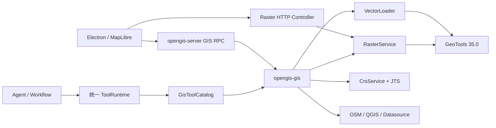
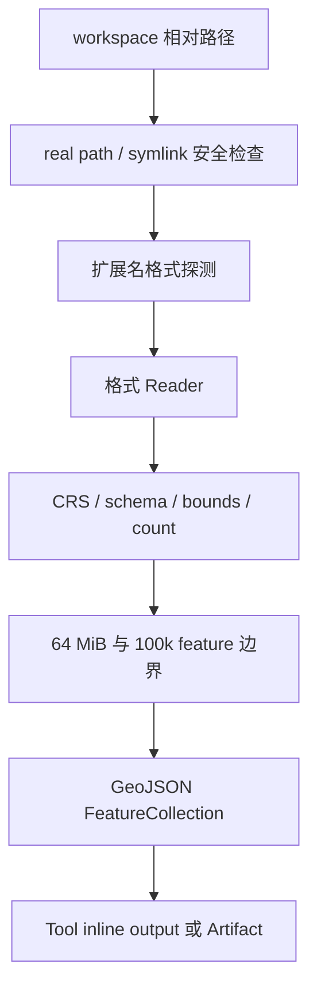

# Phase 7：Java GIS 计算面迁移说明

## 1. 本阶段结果

Phase 7 把 Python 中分散在 Fiona、GeoPandas、Rasterio、OSM、QGIS 和 Datasource Tool 里的 GIS 能力，收拢到 `java-backend/opengis-gis`：

- GeoTools 35.0 负责标准 Vector、CRS 和 GeoTIFF；JTS 负责 Geometry。
- GeoJSON、CSV、Shapefile、GeoPackage、KML 可由 Java Loader 输出 GeoJSON。
- GeoTIFF 支持 metadata、抽样统计、style、自定义色带、XYZ PNG、style revision 与 64 MiB LRU cache。
- OSM、QGIS、Datasource 通过明确的 adapter 边界接入。
- 所有本地路径限制在 workspace；网络响应、要素数、几何点数、输入大小和 tile 坐标都有上限。
- Python/Java 差异由 `.venv` 中的 Python 读取器和 Java IT 自动生成并批准。

GeoTools 35.0 是 2026-06 发布的稳定版；本项目只使用 release 仓库和固定版本，不使用 snapshot。参考 [GeoTools 35.0 release](https://geotoolsnews.blogspot.com/2026/06/geotools-350-released.html) 与 [GeoTools Maven repository 文档](https://docs.geotools.org/stable/userguide/build/maven/repositories.html)。

## 2. 学习用架构



这里最重要的边界是：

1. `opengis-gis` 不依赖 Spring、RPC 或 UI。
2. `opengis-server` 只负责装配、协议和 HTTP。
3. Agent 和 Workflow 必须通过统一 `ToolRuntime` 调用 GIS Tool，继续复用权限、取消、事件和 Artifact 机制。

## 3. 数据格式能力矩阵

| 格式 | 状态 | Java 实现 | 当前边界 |
|---|---|---|---|
| GeoJSON / JSON | 纯 Java，已支持 | Jackson + GeoTools/JTS | 必须为 FeatureCollection；最大 64 MiB、100,000 features |
| CSV Point | 纯 Java，已支持 | Java CSV reader | 自动识别 lat/latitude/y 与 lng/lon/longitude/x |
| Shapefile | 纯 Java，已支持 | `gt-shapefile` | 读取 `.cpg` 字符集，否则 UTF-8；sidecar 必须与 `.shp` 同目录 |
| GeoPackage | 纯 Java，已支持 | `gt-geopkg` | 读取并合并全部 Vector feature table，以 `_opengis_layer` 保留来源层名 |
| KML | 纯 Java，已支持 | 安全 JAXP parser | Placemark 的 Point/LineString/Polygon、MultiGeometry/Multi* 与 Polygon 内外环；KMZ 未纳入 |
| GeoTIFF / TIFF | 纯 Java，已支持 | `gt-geotiff` + ImageIO-Ext | 单波段着色与 XYZ tile；多波段可选 band |
| NetCDF | 纯 Java，已支持 | `gt-netcdf` + UCAR CDM | CF 网格可读取、统计和渲染；多变量文件使用 reader 选定的首个可用 coverage |
| HDF5 / NetCDF-4 | 纯 Java，已支持 | `gt-netcdf` + UCAR pure-Java HDF5 reader | 已用真实 NetCDF-4/HDF5 文件验证；面向可被 CDM 识别的网格数据集 |
| JPEG2000 | 纯 Java，已支持 | `jai-imageio-jpeg2000` | 可读取像素、波段和统计；没有地理参考时不提供地图 tile |
| ASCII Grid | 纯 Java，已支持 | `gt-arcgrid` | 支持标准 ESRI ASCII Grid；`.prj` 提供 CRS |

能力状态也可以通过 `gis_capabilities` Tool 或 `rpc.gis.capabilities` 查询，UI 不需要硬编码。

## 4. Vector Loader 流程



`VectorLoader` 是唯一的文件格式入口。Metadata 使用 `GisMetadata`，避免不同格式返回互不兼容的字典。

CRS 统一按 longitude-first 解码。`CrsService` 支持 EPSG 代码和任意 GeoTools 可解析 CRS；`GeoJsonCrsTransformer` 保留 feature properties/id，只替换 geometry。

`GeometryService` 支持：

- `buffer`
- `centroid`
- `convex_hull`
- `intersection`
- `union`
- `difference`

单个 Geometry 上限为 1,000,000 points，避免无界拓扑计算。

## 5. RasterService

Raster 注册对象只保存源路径、metadata 和 style，不把完整栅格常驻内存。

Metadata 包含：

- width、height、band count、dtype、nodata；
- source CRS、source bbox、WGS84 bbox、resolution；
- 每 band 的 min、max、mean、p2、p98；
- 统计最多抽样 250,000 像元，并按底层 tile 读取，避免复制完整大图。

Tile URL 保持 Python 兼容：

```text
/api/rasters/{raster_id}/tiles/{z}/{x}/{y}.png?rev={style_revision}
```

Style 更新接口：

```text
POST /api/rasters/{raster_id}/style
```

支持 `band/ramp/min/max/opacity/reverse/stops/stopsUnit`。每次更新递增 revision 并清除该 raster 的旧缓存。缓存键为：

```text
raster_id + style_revision + z + x + y
```

注册上限为 64，tile cache 上限为 64 MiB，zoom 限制为 0～24。ImageInputStream、coverage 和 reader 都在 `finally` 中释放，Windows 测试会验证临时 GeoTIFF 可删除。

## 6. 外部 Adapter

### OSM

`osm_call` 支持 `search/overpass_query/download_bbox/download_features`：

- 只访问固定 HTTPS Nominatim 和 Overpass endpoint；
- bbox、tag、geometry type、timeout 和 query 长度均校验；
- response 最大 64 MiB；
- 小 GeoJSON inline 返回，大结果保存到 workspace；
- Overpass multipolygon relation 会拼接成员 way，构造 outer/inner rings，并把洞分配给包含它的外环；无法闭合或引用缺失的 relation 会被明确跳过。

### QGIS

`qgis_call` 保持 Python 的 4-byte big-endian length-prefixed JSON framing：

- 仅允许已登记命令；
- 默认 `127.0.0.1:9876`；
- host 必须解析为 loopback，避免 Agent 借 QGIS 协议访问远程主机；
- 单响应上限 16 MiB；
- 每次请求独立连接，异常后没有污染的共享 socket。

### Datasource

`datasource_call` 支持 `list/get/fetch`。Catalog 位于 Java resources；只允许 catalog 中预登记的 HTTPS URL，调用者不能传任意 URL。下载结果沿用 inline-or-workspace GeoJSON 契约。

## 7. Tool 与 RPC 清单

GIS Tools：

- `gis_capabilities`
- `gis_file_info`
- `load_gis_vector`
- `transform_geojson_crs`
- `geometry_operation`
- `register_raster_tiles`
- `osm_call`
- `qgis_call`
- `datasource_call`

Direct RPC：

- `rpc.gis.capabilities`
- `rpc.gis.file.inspect`
- `rpc.gis.vector.load`
- `rpc.gis.raster.register`
- `rpc.gis.raster.cache_stats`

Raster HTTP：

- `GET /api/rasters/{id}/metadata`
- `POST /api/rasters/{id}/style`
- `GET /api/rasters/{id}/tiles/{z}/{x}/{y}.png`

## 8. 大数据、安全和取消

| 风险 | 门禁 |
|---|---|
| 路径穿越 / symlink escape | 输入使用 `toRealPath`，输出先验证真实 parent |
| 巨型 Vector | 64 MiB 输入上限 + 100,000 feature 上限 |
| 巨型 Geometry | 1,000,000 points 上限 |
| 巨型网络响应 | OSM/Datasource 64 MiB，QGIS 16 MiB |
| 巨型 Raster 统计 | 最多抽样 250,000 pixels，按 source tile 读取 |
| 无限 tile | zoom 0～24 且 x/y 必须落在 zoom grid |
| 取消延迟 | Vector loop、Raster statistics、HTTP stream、OSM conversion 均检查 CancellationToken |
| 临时文件泄漏 | Java 服务不生成 raster 临时预览；测试验证 TIFF handle 可释放 |

## 9. Python/Java 差异批准

`Phase7PythonInteropIT` 使用既有 `python-backend/.venv`，让 Python `GISLoader` 和 Java `VectorLoader` 读取同一 GeoJSON，并生成结构化差异报告。

批准容差：

| 字段 | 容差 |
|---|---:|
| format name | 必须相等 |
| feature count | 0 |
| bounds | `1e-9` degree |
| file size | 0 byte |

脚本位于 `python-backend/tests/phase7_java_gis_contract.py`。任一检查超出容差，IT 直接失败，不允许静默接受。

## 10. 验证命令

```powershell
cd java-backend
mvn verify

cd ..
npm run typecheck
npm run smoke:java-sidecar
python-backend\.venv\Scripts\python.exe -m pytest python-backend\tests\test_protocol_schema.py -q
```

2026-08-02 本阶段验收结果：

- `mvn verify`：377 个单元测试 + 13 个集成测试，共 390 个测试全部通过；Spotless、Checkstyle、依赖收敛和 release dependency 检查通过。
- `Phase7PythonInteropIT`：Python/Java 的格式名、feature count、bounds、file size 四项差异检查全部在批准容差内。
- `npm run typecheck`：通过。
- `npm run smoke:java-sidecar`：Electron 成功启动打包后的 Java sidecar，查询到 GeoTools 35.0、10 项格式能力，并完成 GeoJSON inspect。
- Python 协议 schema 回归：1 个测试通过。

## 11. 推荐阅读顺序

1. `model/GisFormat.java`：先看能力矩阵如何变成代码。
2. `io/WorkspaceGisPaths.java`：理解所有 GIS IO 的安全边界。
3. `vector/VectorLoader.java`：学习统一 Loader 和 metadata。
4. `crs/CrsService.java`、`geometry/GeometryService.java`：学习 CRS 与 JTS 分工。
5. `raster/RasterService.java`：学习 raster 注册、统计、style、tile、cache。
6. `tool/GisToolCatalog.java`：学习领域服务如何接入 Agent。
7. `server/gis/RasterController.java` 与 `Phase7RpcMethods.java`：最后看传输层。
