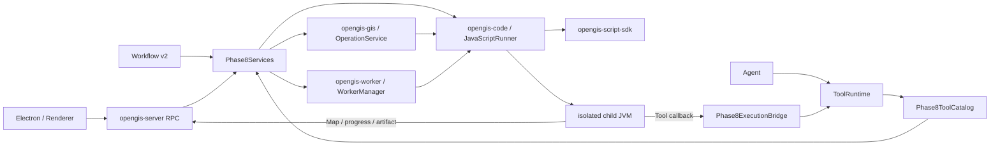

# Phase 8A/B/C：Java 扩展平台迁移说明

## 1. 阶段结果

Phase 8 将可复用 Operation、一次性 Script 和常驻 Worker 统一迁移到 Java，并保留旧 Python 资产的只读识别与迁移报告。

- Phase 8A：`format_converter`、`clustering`、`kernel_density` 三个内置 Operation，以及 workspace Operation v2 全生命周期。
- Phase 8B：版本化 Script SDK、JavaParser/JavaCompiler、Maven 依赖治理、独立子 JVM、双向 JSONL、归档与取消。
- Phase 8C：Java Worker SPI、包管理、恢复、资源与日志、有限退避、动态地图 full/diff 事件。
- 原有工具名和 `rpc.code.*`、`rpc.operations.*`、`rpc.worker.*` 入口由 `opengis-server` 兼容接入，执行端不再调用 Python。
- Workflow v2 的 `operation`、`java_script` 和 `subworkflow` 节点均已接入真实执行器；子工作流同步执行并持久化独立 run，支持取消传播、最大 8 层深度和循环引用拒绝。

## 2. 可学习架构



推荐阅读顺序：

1. `opengis-script-sdk`：先理解用户代码能看到的最小 API。
2. `opengis-code`：理解校验、编译、依赖、父子协议、配额和归档。
3. `opengis-gis/.../operation`：理解 manifest v2、revision/checksum 与三个算法。
4. `opengis-worker`：理解常驻进程状态机和动态地图序列。
5. `opengis-server/.../phase8`：最后理解 Tool/RPC/Workflow 如何组合领域模块。

## 3. Phase 8A：Operation v2

工作区结构：

```text
<workspace>/.opengis/operations/<operation-id>/
├── operation.json
├── README.md
├── src/main/java/<package>/<Entry>.java
└── revisions/000001/{manifest.json,source.java}
```

manifest v2 固定记录 `schema_version`、`api_version`、Java entry class、JDK、Maven dependencies、permissions、输入/输出 schema、revision、checksum 与 provenance。Python v1 会标记为 `legacy-python + read_only`，Java 模式永不执行它。

生命周期包括 list/get/copy/create/edit/validate/run/promote：

- edit 每次增加 revision，并保存不可变快照。
- run 记录实际 revision/checksum，防止运行结果与后来编辑的源码混淆。
- promote 只接受 Script Archive 中有成功 run record 的 `.java`。
- 自定义 Operation 经 JavaParser、JavaCompiler 和依赖检查后在子 JVM 执行；内置可信算法在进程内执行。

内置算法：

| Operation | 能力 | 明确边界 |
|---|---|---|
| `format_converter` | GeoJSON、CSV/WKT、KML、SHP、GPKG | 输出路径受 workspace 限制 |
| `advanced_clustering` | DBSCAN、KMeans、HDBSCAN 风格、OPTICS 风格、层次聚类 | 精确算法最多 5,000 features；EPSG:4326 距离按米计算 |
| `kernel_density` | 六种 kernel、权重、归一化、float GeoTIFF、可选 contour/polygon | 最多 1,000,000 cells；polygon 最多 50,000 |

## 4. Phase 8B：Script SDK 与 Runner

SDK 入口：

- `OpenGisScript` / `ScriptContext`
- `ToolClient`：父进程重新进入 `ToolRuntime`，不会绕过权限。
- `ArtifactClient`：只登记工作区真实路径内的文件并记录 SHA-256。
- `MapClient`：发送受控地图通知。
- `ProgressEmitter`：发送 0～1 的结构化进度。
- `OpenGisWorker` / `WorkerContext` / `DynamicMapEmitter`：供 Phase 8C 复用。

Runner 流程：

```text
source -> JavaParser policy -> Maven resolve -> JavaCompiler --release 21
       -> child JVM (-Xmx) -> protocol 1.0 JSONL -> terminal run.json
```

门禁包括：固定 release 依赖、禁止 snapshot/dynamic version、显式审批、group allowlist、offline cache、checksum、POM license 与 repository 留痕；协议帧、日志、文件数、超时、堆内存均有限额。取消、超时、协议错误和 Sidecar 中断都会清理整个后代进程树。这里提供的是进程隔离与权限代理，不宣称是 OS 级强沙箱。

Script Archive 位于 `.opengis/scripts`，运行记录位于 `.opengis/script-runs/<run-id>`。旧 UI 需要的 `rpc.code.script_started/stdout/stderr/script_done` 通知仍保持。

## 5. Phase 8C：Java Worker

Worker 包位于 `<workspace>/worker/<slug>-<worker-id>`，包含 manifest、config、metadata、README 和标准 Maven 源码路径。生命周期状态保存在 `metadata.json`；后端重启时，陈旧的 running/starting/restarting 会恢复为可解释的 paused，必须显式 restart。

- 默认最多同时运行 2 个 Worker。
- auto-restart 最多 3 次，使用有限指数退避，禁止无限重启风暴。
- get/list 可返回 PID、alive、CPU time 和日志尾部。
- pause/restart/delete 会取消 token 并清理子 JVM 进程树。
- 动态地图方法只接受 `rpc.ui.map.*`；同一 layer 的 sequence 必须严格递增。
- Python Worker 生成 `manual_migration_required` 报告、依赖/RPC/权限风险和可编译 Java 模板，不做不可靠的自动语义翻译。

## 6. 兼容入口

Agent 工具：8 个 Operation 生命周期工具、`execute_code`、8 个 Worker 生命周期工具。Script 子进程发出的 Tool 调用由 `Phase8ExecutionBridge` 重新进入统一 Registry、JSON Schema、PermissionRuntime、事件和 Artifact 流程。

Direct RPC 新旧入口包括：

- `rpc.code.run_script/cancel_script/list_scripts/read_script`
- `rpc.operations.list/get/run/copy/create/edit/validate/promote/legacy_report`
- `rpc.worker.list/get/start/pause/restart/delete/wait/migration.inspect`

## 7. 验证

```powershell
cd java-backend
mvn verify

cd ..
npm run typecheck
npm run smoke:java-sidecar
python-backend\.venv\Scripts\python.exe -m pytest python-backend\tests\phase8_java_extension_contract.py python-backend\tests\test_protocol_schema.py -q
```

重点场景由 Java 测试真实启动子 JVM：Script stdout/progress/Tool callback/Artifact、非法源码、Operation 三算法与 workspace revision、Worker start/dynamic event/resource/pause/restart/delete/restore，以及 Python 资产迁移报告。

2026-08-02 验收结果：

- `mvn verify`：399 tests，0 failure/error/skip；Spotless、Checkstyle、依赖收敛与 release dependency 门禁通过。
- Phase 8 Python/Java 只读契约与协议 schema：4 tests passed，且只使用 `python-backend/.venv`。
- `npm run typecheck`：通过。
- `npm run smoke:java-sidecar`：使用包含 `jdk.compiler` 的 jlink JRE，Electron 成功列出三个 Operation、执行 Java Script、启动并暂停 Java Worker。

## 8. 尚未扩大范围的事项

- Maven 在线下载必须同时满足依赖审批和非离线请求；默认继续采用 offline，避免 Agent 隐式下载。
- Java 进程隔离不是容器或操作系统沙箱，高风险部署仍应增加 OS 级账户、容器或 Job Object/cgroup。
- Python 用户代码只生成报告和模板；确认结果前不会标记 converted。
- Electron 默认 Java、安装包去除 Python 运行依赖属于 Phase 9/10；`python-backend/` 源码、依赖清单和历史测试永久保留为恢复备份，不会删除。
