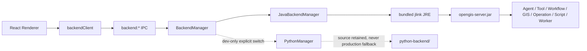

# Phase 9：UI/Electron 去 Python 化

## 1. 阶段结果

桌面端主链已经切换为 Java：Electron 启动 bundled JRE 中的 `opengis-server.jar`，Renderer 通过通用 WebSocket JSON-RPC 客户端访问 Java。首次启动不再下载 Python、不再创建 venv、不再执行 pip，安装包也不携带 `python-backend/`。

`python-backend/` 没有删除。它继续作为 Git 中的源码备份、迁移语义参考和差异测试基线存在；只有未打包开发环境显式设置 `OPENGIS_BACKEND=python` 时才允许使用，且不会自动准备环境或在 Java 失败时自动回退。

## 2. 可学习架构



建议按以下顺序学习：

1. `electron/ipc/backendTypes.ts`：先理解生命周期接口和统一状态结构。
2. `electron/ipc/backendManager.ts`：理解生产强制 Java、开发显式兼容开关。
3. `electron/ipc/javaBackendManager.ts`：理解端口分配、子进程、stdout token/ready、重启、停止和最后成功标记。
4. `electron/main.ts` 与 `electron/preload.ts`：理解主进程如何把通用 IPC 安全暴露给 Renderer。
5. `src/services/backendClient.ts` 与 `src/App.tsx`：理解 Renderer 如何建立带 token 的 JSON-RPC WebSocket。
6. `java-backend/opengis-server/.../phase9/PivotAnalysisService.java`：理解结构化 Pivot 请求，不执行用户拼接源码。

## 3. 启动与故障边界

正常启动链：

```text
Electron ready
  -> 创建 Loading/Main Window
  -> BackendManager 选择 Java
  -> 校验 bundled java 与 server JAR
  -> 分配 127.0.0.1 随机端口
  -> java -jar ... --host --port --log-dir
  -> 捕获 OPENGIS_WS_TOKEN
  -> 捕获 OPENGIS_READY
  -> Renderer 使用 backend:* IPC 获取端口/token
  -> backendClient 建立 WebSocket
```

Java 意外退出最多有限重启 3 次。启动失败弹出 Retry/Open Logs/Quit，并明确提示 workspace 未被修改且 Python fallback 被禁用。每次成功启动会原子写入 `java-backend-last-good.json`，包括 app 版本、JAR SHA-256 和验证时间，供升级故障诊断。

## 4. UI 迁移

- 状态栏和设置页显示 Java Backend，不再提供 Python path/venv 设置。
- Settings schema 升级为 v3，固定 `backend.runtime=java`、`protocolVersion=3.0`、`pythonBackup=retained`；读取旧设置时移除 Python 配置和 fallback。
- Script Runner 默认 `.java`、Monaco Java、`OpenGisScript` 模板，由独立子 JVM 执行。
- Operation Editor 展示 Java entry、language 和 JDK 21。
- Approval、Workflow、Worker、Chat code step 和 i18n 使用 Java/runtime-neutral 语义。
- Pivot 调用 `rpc.analysis.pivot`，只发送 rows/columns/raster stats 等结构化数据；Java 对行列数和 bucket 数设上限。

## 5. 打包结构

```text
resources/
├── java-runtime/
│   └── bin/java(.exe)
├── java-backend/
│   └── opengis-server.jar
└── icons/
```

`electron/scripts/build-java-runtime.mjs` 在当前 Windows 发布环境使用 Maven Wrapper 构建 Server，通过 jdeps 计算模块，并显式加入 JavaCompiler 所需的 `jdk.compiler` 后执行 jlink。`electron-builder.yml` 不再包含 Python 源码、Python 解释器或开发专用 Python Manager。

## 6. 验证

2026-08-03 Windows 本机结果：

- `mvn verify`：401 tests，0 failure/error/skip。
- `npm test -- --run`：158 tests passed。
- `npm run typecheck`、`npm run build`：通过。
- `npm run build:java-runtime`：生成 JDK 21 jlink runtime。
- `npm run smoke:java-sidecar`：Agent/Tool、Workflow、GIS、Pivot、Operation、Java Script、Java Worker 和退出清理通过。
- `npm run audit:phase9-package`：bundled JRE/Server 存在，生产包不存在 `python-backend/`。
- `npm run smoke:packaged`：`dist/win-unpacked/OpenGIS.exe` 使用内置 Java 启动并正常退出。

2026-08-03 用户将当前产品发布范围明确收敛为 Windows-only。`.github/workflows/phase9-desktop.yml` 因此只在 Windows 干净 runner 上构建 JRE、运行全量测试、Sidecar smoke、解包应用和 packaged startup/exit；macOS/Linux 不再是 Phase 9/10 的验收条件。

## 7. Python 备份恢复边界

恢复规则见 `python-backend/BACKUP_POLICY.md`。Phase 9 不删除 Python 文件，不修改其历史依赖清单，也不将 `.venv` 当作备份。开发对照模式必须显式设置环境变量并承担环境准备责任：

```powershell
node python-backend/setup-python.mjs
$env:OPENGIS_BACKEND='python'
npm run dev:electron
```

打包应用会忽略该变量并强制 Java。任何 Java RPC 失败都不会触发 Python 请求或 Python Sidecar。
