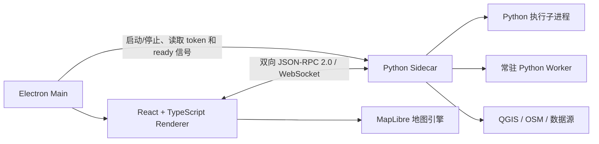
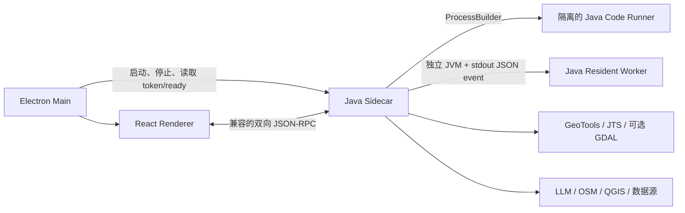
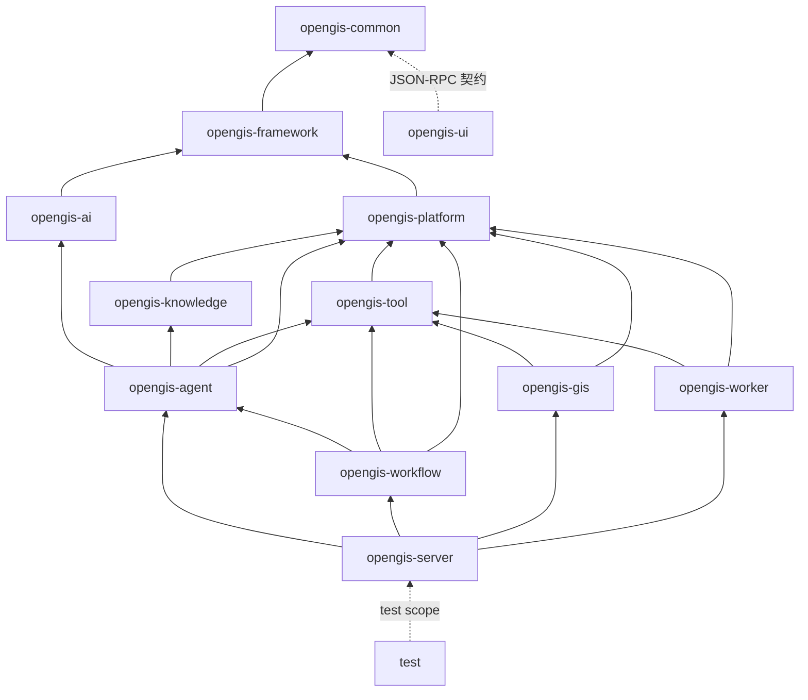
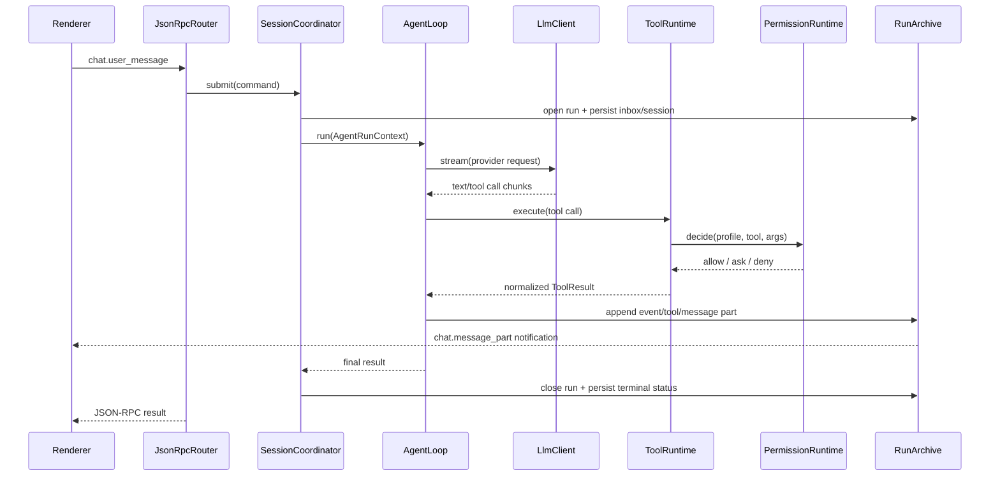

# OpenGIS Python 后端迁移至 Java：完整迁移计划方案

> 文档状态：初稿，可作为迁移总纲、学习路线和阶段验收清单
>
> 编写依据：当前仓库 `python-backend/`、`electron/`、`src/`、`README.zh.md` 与现有测试
>
> 目标读者：希望通过真实项目学习 Java 架构，并逐步完成迁移的开发者
>
> 最后更新：2026-08-02

## 1. 结论先行

OpenGIS 当前不是一个普通的 Python Web 服务，而是一个由 Electron 主进程、React/TypeScript Renderer、Python Sidecar、Python 执行子进程和常驻 Worker 共同组成的桌面 GIS Agent 系统。Python 后端同时承担：

- FastAPI/uvicorn 服务和双向 JSON-RPC；
- LLM Provider 适配、Agent Loop、上下文和记忆；
- Tool、Skill、Operation、Workflow、Worker；
- 权限审批、会话队列、运行归档、事件流；
- GeoPandas、Rasterio、Fiona、Shapely、PyProj 等 GIS 处理；
- Agent 生成代码的执行、依赖安装和子进程控制。

因此，推荐的目标不是把 `.py` 文件逐个翻译为 `.java`，而是建设一个 **Java 21+、Spring Boot、Maven 多模块、模块化单体、六边形边界** 的 Java Sidecar，并用 **绞杀者模式** 分阶段替换 Python 能力。迁移过程中保持前端 JSON-RPC、MessagePart、动态地图事件及 `.opengis/` 数据格式兼容；最终生产环境只启动 Java，但 `python-backend/` 源码、依赖清单和历史测试永久保留为只读备份，不从仓库删除。

### 1.1 推荐路线

1. 冻结并记录现有协议和行为，建立 Python “黄金基准”。
2. 在 `java-backend/` 中按参考架构新建 `opengis-common` 至 `opengis-server` 等 Maven 模块，先实现启动、健康检查、WebSocket 和 JSON-RPC 外壳。
3. 迁移持久化、Tool Runtime、权限、会话和归档等确定性较强的控制面。
4. 迁移 LLM/Agent/Context/Workflow 等编排能力。
5. 最后迁移 GIS、Operation、Java 代码执行和 Worker 等计算面。
6. Electron 通过配置在 Python/Java Sidecar 间切换；每阶段支持回退。
7. 达到所有兼容门槛后，停止打包 Python，保留只读迁移工具和旧数据备份。

### 1.2 “迁移完成”的定义

同时满足以下条件才算完整迁移，而不是“Java 服务能够启动”：

- Electron 安装包不再安装或启动 Python 解释器、venv、pip 包。
- Java Sidecar 覆盖现有前端实际调用的 REST、WebSocket、JSON-RPC 和反向 RPC。
- Agent、Tool、Permission、Session、Queue、Memory、RunArchive、Workflow 正常工作。
- 内置 GIS Tool 和三个内置 Operation 已获得可接受的功能与数值等价性。
- Resident Worker 已迁移为独立 Java Worker 进程或明确的新 Worker SPI。
- Agent 生成代码的默认语言改为 Java，并在隔离子 JVM 中执行。
- 旧 `.opengis/` 数据可直接读取或通过一次性、幂等、可回滚的迁移完成升级。
- Workflow v2 不再依赖 `.py` 脚本或 Python Hook；Pivot、Script Runner、Operation Editor 等前端路径不再生成或要求 Python 代码。
- 所有当前公开的 LLM Provider 已由 Java 支持，或在下线 Python 前经过正式废弃、数据迁移和 UI 移除。
- 所有内置 Tool、Report/Plot、Subagent、Operation、Worker 与 workspace 模板均已进入全量迁移台账并完成验收。
- 用户 workspace 中的 Python Script、Operation、Worker 和 Workflow 已被转换、归档或由用户明确确认放弃；Java-only 模式不会静默执行或忽略它们。
- Java 测试、前端测试、端到端测试和安装包冒烟测试全部通过。
- Python 后端进入只读归档期，至少经过两个稳定发布周期后再移除源码。

完整迁移分为三个必须分别验收的层级：

1. **应用后端完成**：OpenGIS 自身启动和运行不需要 Python。
2. **内置能力完成**：所有随应用发布的 Tool、Operation、Workflow、Report、Code Runner 和 Worker 都已 Java 化。
3. **用户资产处置完成**：任意用户 Python 资产不承诺自动无损翻译，但必须得到“已转换、只读归档、明确放弃”三种终态之一。

## 2. 当前系统基线

### 2.1 当前进程模型



必须保留的事实边界：

- 地图事实状态和 MapLibre 句柄在前端，后端只能通过 `rpc.ui.map.*` 操作地图。
- 重 GIS 计算当前在 Python，结果通过文件、GeoJSON、栅格瓦片或事件返回。
- `src/services/pythonClient.ts` 不只是客户端，还处理请求超时、重连、反向请求、通知广播和动态图层合并。
- Electron 通过 stdout 中的 `OPENGIS_WS_TOKEN=...` 和 `OPENGIS_READY` 判断 Sidecar 就绪。

### 2.2 Python 后端规模

当前 `opengis_backend` 约有 145 个 Python 源文件，其中 `agent/` 约 71 个，是迁移规模最大的区域。主要模块如下：

| 当前目录 | 当前职责 | 迁移难度 |
|---|---|---:|
| `rpc/`、`server.py` | REST、WebSocket、JSON-RPC 分发 | 中 |
| `agent/loop/` | Agent 迭代、停止、重试、异常保护 | 高 |
| `agent/execution/` | Tool Runtime、参数、结果、代码和子进程执行 | 很高 |
| `agent/context/` | Context、压缩、Provider 投影、失败记忆 | 很高 |
| `agent/session/` | Session、Inbox、Queue、恢复 | 高 |
| `agent/governance/` | Profile、Permission、持久化规则 | 中 |
| `agent/telemetry/`、`runs/` | 事件、MessagePart、Artifact、RunArchive | 中 |
| `agent/workflow/` | Workflow 模型、存储、DAG 运行 | 高 |
| `tools/` | Tool schema、注册和大量内置工具 | 很高 |
| `integrations/` | GIS、Raster、OSM、QGIS、Datasource | 很高 |
| `operations/` | 内置和 workspace Operation | 很高 |
| `worker/` | 常驻 Worker、stdout 动态地图协议 | 很高 |
| `workspace/` | Git 快照、模板、记忆 | 中 |
| `sandbox/` | 用户代码运行和取消 | 高 |

现有 Python 测试重点覆盖 Agent Loop、Workflow Loop、Tool Runtime 自动安装、权限、上下文、Provider 投影、运行归档、Worker 协议和 RPC 动态事件合并。这些测试应转换为跨语言契约测试，而不是迁移后丢弃。

### 2.3 必须冻结的外部契约

1. REST：`/api/health`、`/api/tools`、`/api/user-skills`、`/api/system/logs-dir`、栅格 metadata/style/tile、`/api/rpc`。
2. WebSocket：`/ws?token=...`，仅监听 loopback，使用 JSON-RPC 2.0。
3. Renderer 到后端：`chat.user_message`、`event.*`、`rpc.agent.*`、`rpc.code.*`、`rpc.debug.*`、`rpc.fs.*`、`rpc.operations.*`、`rpc.runs.*`、`rpc.tool.*`、`rpc.user_skill.*`、`rpc.worker.*`、`rpc.workspace.*`、用户指令相关方法。
4. 后端到 Renderer：`chat.message_part`、`chat.cancelled`、`chat.title_generated`、`rpc.ui.ask.*`、`rpc.ui.chat.*`、`rpc.ui.map.*`、`rpc.ui.layout.*`、`rpc.ui.fs.*`。
5. 动态地图事件：全量帧覆盖旧帧，diff 帧必须保序，前后端都存在短时间窗口的合并逻辑。
6. 启动信号：`OPENGIS_WS_TOKEN` 必须先于 `OPENGIS_READY` 输出，且使用 UTF-8 单行文本。
7. JSON 约束：snake_case 字段、ISO 时间、数值/数组序列化、错误码、`id` 关联、notification 无 `id`。

### 2.4 必须保护的持久化数据

| 路径 | 内容 | Java 迁移要求 |
|---|---|---|
| `.opengis/runs/<run_id>/` | meta、steps、events、tool_calls、message_parts、artifacts、LLM usage | 首期原格式读写兼容 |
| `.opengis/sessions.json` | Session、Inbox、恢复状态 | 原子写入，启动时修复陈旧 running 状态 |
| `.opengis/contexts/` | 会话上下文 | 支持旧 schema，新增 `schema_version` |
| `.opengis/workflows/*.flow.json` | Workflow DAG | DTO 和拓扑语义兼容 |
| `.opengis/agents.json` | Agent Profile | 默认 profile 和用户配置不丢失 |
| `.opengis/permissions.json` | 权限规则 | 匹配顺序和 ask/allow/deny 语义一致 |
| `.opengis/artifacts.jsonl` | Artifact 索引 | append-only、损坏行容错 |
| `.opengis/titled_conversations.json` | 已自动生成标题的 conversation ID | 保持幂等，避免重复调用 LLM 生成标题 |
| `.opengis/memory.md`、`.opengis/memory/` | 旧版自由文本记忆和新版结构化记忆 | 两种格式均可读，迁移后保留来源与版本 |
| `.opengis/scripts/`、`_scripts_index.jsonl`、脚本 `.metadata.json` | 可复用脚本及运行归档索引 | Python 脚本标记 legacy，Java 脚本使用新 runtime 字段 |
| `.opengis/operations/` | Workspace Operation | 标记 Python legacy 与 Java runtime |
| `.opengis/operation-runs/` | Operation 运行记录 | 保留历史可读性 |
| `.opengis/skills/`、skill sources | Skill 包和来源 | 发现优先级兼容 |
| `.opengis/runs/<run_id>/run.log`、`final_answer.md` | 运行日志和最终回答快照 | Java Reader/Writer 保持兼容 |
| Workspace Worker 的 `manifest.json`、`config.json`、`metadata.json`、stdout/stderr 日志 | Worker 包和运行状态 | 旧 Python Worker 只读识别，新 Java Worker 使用 runtime v2 |
| `~/.opengis/user_instructions.md` | 全局用户指令 | 路径和编码兼容 |
| Electron 用户目录 `settings.json`、`projects.json` | 模型、后端、外观和项目清单 | 将 `python` 设置迁移为通用 `backend`，保留旧字段兼容 Reader |
| 内置和 workspace datasource catalog | 数据源定义 | 增加 schema 版本、来源与升级测试 |

### 2.5 全量能力与资产迁移台账

Phase 0 必须生成版本化的 `docs/migration/migration-matrix.yaml`（也可同时导出 CSV），作为是否允许下线 Python 的唯一清单。仅在文档中写“迁移 Tool/RPC”不算完成。

每条记录至少包含：

```yaml
kind: rpc | event | tool | persistence | frontend | operation | worker | external_runtime
name: rpc.runs.replay
python_source: python-backend/opengis_backend/rpc/handler.py
consumers:
  - src/stores/runsStore.ts
java_module: opengis-server
java_target: RunsReplayRpcHandler
contract_fixture: test/contracts/rpc/runs-replay.json
decision: migrate | deprecate | legacy-readonly
status: pending | implementing | verified | removed
owner: unassigned
notes: ""
```

台账必须覆盖：

- 所有 REST endpoint、正向/反向 JSON-RPC、`chat.*`、`event.*` 和 Electron IPC；
- 所有 Tool，包括文件、Shell、Web、Map、Layout、Raster、Report、Plot、Academic、Plan、Subagent、Debug、Script、Skill、Operation、Workflow、Worker、OSM、QGIS、Datasource；
- 所有 `.opengis` 与 Electron 用户目录持久化文件；
- 所有 Python Script、Operation、Worker、Workflow Hook、Pivot 和模板；
- Pandoc、mdpdf、WeasyPrint、GDAL、QGIS、字体、Python build/venv 等外部运行时；
- 对应 Java 类、前端消费者、contract fixture、验收测试、兼容或废弃决定。

下线门槛：台账中不得存在 `pending`、未批准的 `deprecated` 或仍被生产路径引用的 `python-only` 项。

## 3. 迁移目标、原则与非目标

### 3.1 目标

- 后端使用 Java 构建，结构清楚到可以按一次请求逐层阅读。
- 业务逻辑不依赖 Spring、WebSocket、Jackson 或磁盘细节。
- Agent、Tool、GIS、Worker 等边界显式，禁止重新堆回一个巨型 Handler。
- 所有运行都有 `runId`、取消信号、权限上下文、事件和可追踪日志。
- 协议先兼容、实现后替换；阶段内始终存在一条可运行主路径。
- GIS 数值正确性由样本数据、容差和输出属性共同定义。
- 默认单机、loopback、本地文件架构，不为“未来可能微服务化”提前增加分布式复杂度。

### 3.2 非目标

- 不迁移 React、TypeScript、MapLibre 和 Zustand 前端。
- 不在第一阶段更换 JSON-RPC 协议或重写 UI。
- 不在迁移同时引入数据库、消息队列、Kubernetes 或微服务。
- 不保证任意用户自定义 Python 脚本能自动无损翻译为 Java；必须提供审计、兼容期和人工迁移说明。
- 不追求 GeoPandas 与 Java GIS 库每个边缘行为完全一致；对外契约和业务允许的数值容差才是验收依据。

### 3.3 架构原则

1. **契约优先**：协议 DTO 与领域模型分开。
2. **显式上下文**：公共执行身份、Agent 上下文和 Tool 上下文分别使用 `ExecutionIdentity`、`AgentRunContext`、`ToolExecutionContext` 显式传递，不依赖全局变量或异步 `ThreadLocal`。
3. **单一执行入口**：所有 Tool 都通过 `ToolRuntime` 完成参数校验、权限、执行、归一化、归档和事件发布。
4. **端口与适配器**：LLM、文件系统、Git、QGIS、OSM、进程、时钟都通过接口隔离。
5. **先模块化单体**：各模块进程内调用，只有用户代码和 Worker 进入子进程。
6. **追加优先、原子更新**：事件使用 JSONL 追加，快照文件使用临时文件 + 原子替换。
7. **行为可比**：Python 与 Java 可对同一 fixture 运行并生成差异报告。
8. **可回退**：每个阶段都有 feature flag 和 Python 回退路径。

## 4. 目标 Java 总体架构

### 4.1 目标进程模型



目标仍是桌面本地 Sidecar，不是远程 Web 后端。Java 服务只监听 `127.0.0.1`，每次启动生成随机 WebSocket token，并由 Electron 管理生命周期。

### 4.2 推荐技术栈

| 领域 | 推荐选择 | 选择原因 |
|---|---|---|
| JDK | Java 21 或团队确认后的更新 LTS | 生态成熟、record、sealed type、虚拟线程可用 |
| 构建 | Maven Wrapper + Maven 多模块 | 学习资料丰富、依赖关系直观、适合稳定打包 |
| 服务 | Spring Boot 3.x | 生命周期、配置、健康检查、WebSocket 和打包成熟 |
| 并发 | Spring WebFlux 传输层 + 显式 `CompletableFuture`/虚拟线程执行层 | WebSocket 流不阻塞，计算任务仍易读 |
| JSON | Jackson | JSON-RPC、JSONL、snake_case、流式读写成熟 |
| 校验 | Jakarta Validation + NetworkNT JSON Schema | DTO 校验与 Tool/Operation 动态 schema 分工清楚 |
| LLM | 自建 `LlmClient` 端口；按 Provider 建适配器 | 避免 Agent 核心绑定某一家 SDK；保留多 Provider 能力 |
| Vector GIS | GeoTools + JTS | Java GIS 主流组合，覆盖矢量格式、CRS 和几何运算 |
| CRS | GeoTools referencing；必要时补 Proj4J | 统一 CRS 解析和变换 |
| Raster | GeoTools Coverage；复杂格式/性能场景可选 GDAL JNI | 分层隔离 native 依赖，先保证可打包 |
| 表格 | Apache Commons CSV、Apache POI；必要时 Tablesaw | 避免把所有数据都强行建成 DataFrame |
| 聚类/数值 | Smile、Apache Commons Math、必要时 ELKI | 替代 scikit-learn/SciPy 的常见算法 |
| HTTP | JDK HttpClient 或 Spring WebClient | 支持流式响应、超时、取消和代理配置 |
| 重试 | Resilience4j | Provider/网络重试与 Agent 自身重试分离 |
| 观测 | SLF4J + Logback + Micrometer | 结构化日志、计时、计数和诊断 |
| 测试 | JUnit 5、AssertJ、Mockito、ArchUnit、WireMock、Testcontainers | 单元、架构、HTTP Provider 和集成测试 |
| 打包 | `jlink` 自带精简 JRE + electron-builder extraResources | 用户无需安装 Java |

版本号应在开始实施时通过一次 ADR 固定，不要在业务模块中散落版本。优先选择纯 Java 依赖；GDAL JNI 等 native 依赖必须封装在独立适配器中，并在当前 Windows x64 发布范围内验证。

### 4.3 采用参考架构后的顶层目录

可以采用参考项目的 `common / framework / platform / ai / knowledge / agent / tool / workflow / server / ui / test` 模块划分。OpenGIS 还必须增加 `opengis-gis` 和 `opengis-worker` 两个项目特有模块，否则 GIS、栅格、Operation 和常驻进程最终会把 `platform` 或 `tool` 变成新的巨型模块。

建议最终仓库结构如下：

```text
OpenGIS/
  .github/                              # CI、Issue/PR 模板、Windows 构建
  docs/                                 # 总体文档、协议、迁移记录、ADR
  python-backend/                       # 永久保留的 Python 参考/恢复备份；生产默认不启动
  java-backend/                         # Java Maven 聚合工程，与 Python 后端并列
    pom.xml                             # Java 聚合父 POM
    mvnw / mvnw.cmd / .mvn/             # 固定 Maven 环境
    config/                             # Checkstyle 等统一质量配置
    opengis-common/                     # 最底层公共模型与线上契约
    opengis-framework/                  # 可复用技术框架和基础设施抽象
    opengis-platform/                   # OS、workspace、文件、Git、进程等平台能力
    opengis-ai/                         # LLM 模型、Provider、流式协议、token 预算
    opengis-knowledge/                  # Context、Memory、Skill、知识提取
    opengis-agent/                      # Agent Loop、Session、Queue、Telemetry
    opengis-tool/                       # Tool SPI、Registry、Runtime、Permission、通用工具
    opengis-workflow/                   # Workflow 模型、DAG、child session 编排
    opengis-gis/                        # GIS/栅格/OSM/QGIS/DataSource/Operation
    opengis-worker/                     # Worker SPI、独立 JVM 管理、动态地图协议
    opengis-server/                     # Spring Boot、REST、WebSocket、JSON-RPC、总装配

  opengis-ui/                           # 现有 Electron + React + TypeScript + MapLibre
  sql/                                  # 预留数据库脚本；当前文件存储阶段不启用
  test/                                 # 跨模块契约、黄金数据、集成、E2E、性能测试
```

`opengis-ui` 不是 Maven 子模块，它继续使用现有 Node/Electron 构建链。迁移前期也不必立刻移动当前 `src/`、`electron/`、`resources/` 和 `package.json`；可先把它们逻辑上视为 `opengis-ui`，等 Java 后端切换稳定后再做一次纯目录重构，避免迁移期间同时产生大量无功能变化的前端 diff。

`java-backend/` 是 Java 后端的唯一工程根目录。所有 Java 模块、Wrapper、父 POM 和 Java 质量配置都放在其中；仓库根目录不再散放 `opengis-*` Java 模块。这样迁移期能清楚区分 Python 后端、Java 后端和 UI。

`sql/` 只作为将来引入数据库时的迁移脚本目录。当前 `.opengis` 仍使用 JSON/JSONL 文件，不应为了模仿参考目录而提前引入数据库。

### 4.4 各模块职责

| 模块 | 只负责什么 | 明确不负责什么 |
|---|---|---|
| `opengis-common` | ID、错误码、值对象、`ExecutionIdentity`、取消/Event 契约、JSON-RPC/MessagePart/Event DTO、SPI 最小契约 | `AgentProfile`、Spring Bean、磁盘、HTTP、GeoTools、业务编排 |
| `opengis-framework` | JSON/JSONL、schema 校验、事件总线、取消模型、并发工具、配置/日志基础、原子文件写抽象 | Agent 决策、GIS 算法、具体 RPC handler |
| `opengis-platform` | workspace 路径、`.opengis` 存储、Git、文件系统、Shell/进程、用户偏好、系统信息 | Agent Loop、LLM Provider、GIS 算法 |
| `opengis-ai` | provider-neutral LLM 模型、OpenAI-compatible 等 Provider adapter、流式解析、usage/token、重试 | Agent 步骤策略、工具执行、会话存储 |
| `opengis-knowledge` | Context、Memory、FailureMemory、KnowledgeExtractor、Skill discovery、用户/项目知识投影 | 发起 Agent Loop、直接执行 Tool |
| `opengis-tool` | Tool SPI、Definition、Registry、JSON Schema 参数、Permission、ToolRuntime、文件/Shell/Web/UI 通用工具 | Agent 循环、Workflow DAG、具体 GIS 库实现 |
| `opengis-agent` | AgentProfile、SessionCoordinator、Inbox/Queue、TurnRunner、LoopKernel、RuntimeControl、Telemetry | REST/WebSocket、GeoTools、具体 Provider SDK |
| `opengis-workflow` | WorkflowDocument、拓扑排序、节点状态、child session 和输出传递 | 另一套 Agent/Tool Runtime |
| `opengis-gis` | GeoTools/JTS、vector/raster、CRS、OSM/QGIS/DataSource、三个内置 Operation，并贡献 GIS Tool | Chat/Session/RPC 传输 |
| `opengis-worker` | Worker SPI、Worker 包、子 JVM 生命周期、日志、stdout 动态地图事件，并贡献 Worker Tool | Agent 主循环、Renderer 地图状态 |
| `opengis-server` | Spring Boot main、REST、WebSocket token、JSON-RPC registry/handler、Bean 总装配、ready 信号 | 可复用领域规则和 GIS 算法 |
| `opengis-ui` | Electron 生命周期、React UI、MapLibre、Zustand、前端 RPC dispatcher | Java 后端计算和持久化 |
| `test` | Python/Java/TypeScript 契约、GIS fixture、黄金测试、E2E、性能与发行冒烟 | 生产业务代码 |

`opengis-common` 必须保持很小。新增代码不能因为“不知道放哪里”就进入 common；只有两个以上上层模块都必须共享、且不包含技术实现的稳定契约才能放入其中。

#### 4.4.1 推荐的模块内部包结构

```text
java-backend/opengis-common/src/main/java/org/opengis/common/
  id/                  # RunId、SessionId、ToolCallId
  error/               # 统一错误码和基础异常
  context/             # ExecutionIdentity、CancellationToken、EventSink 契约
  protocol/            # JSON-RPC、MessagePart、UI Event DTO
  spi/                 # ClockPort 等不含业务类型的最小跨模块端口

java-backend/opengis-framework/src/main/java/org/opengis/framework/
  json/                # ObjectMapper 配置、JSONL、snake_case
  validation/          # JSON Schema/Jakarta 校验适配
  event/               # 进程内 EventBus 和 EventSink
  concurrent/          # 取消、任务注册、超时、锁
  config/              # 通用配置绑定
  logging/             # MDC/结构化日志和敏感字段过滤

java-backend/opengis-platform/src/main/java/org/opengis/platform/
  workspace/           # Workspace 定位、边界校验、模板
  storage/             # 原子 JSON、append-only JSONL、schema migration
  filesystem/          # 文件读写、glob、grep、diff
  git/                 # snapshot、revert、Git 不可用降级
  process/             # ProcessBuilder、进程树、stdout/stderr
  userprefs/           # 全局与 workspace 用户指令

java-backend/opengis-ai/src/main/java/org/opengis/ai/
  model/               # LlmRequest、Message、ToolCall、Chunk、Usage
  port/                # LlmClient
  provider/openai/     # OpenAI-compatible adapter
  provider/.../        # 其他 Provider adapter
  stream/              # SSE/增量 tool call 组装
  token/               # token 估算和 request budget

java-backend/opengis-knowledge/src/main/java/org/opengis/knowledge/
  context/             # ContextManager、WorkingState、ContextProjector
  memory/              # facts、recipes、dataset cards、failure memory
  skill/               # Skill discovery、source、load
  extraction/          # KnowledgeExtractor
  persistence/         # Context/Memory 的 feature-owned store

java-backend/opengis-tool/src/main/java/org/opengis/tool/
  api/                 # OpenGisTool、ToolDefinition、ToolResult、UiRpcPort
  context/             # ToolExecutionContext、PermissionSubject/PolicySnapshot
  registry/            # ToolRegistry、tool groups
  runtime/             # ToolRuntime、参数、结果、artifact materializer
  permission/          # allow/ask/deny、规则与请求
  builtin/file/        # read/write/edit/list/glob/grep
  builtin/shell/       # shell tool
  builtin/web/         # search/fetch
  builtin/ui/          # map/layout/chat 反向 RPC 通用封装

java-backend/opengis-agent/src/main/java/org/opengis/agent/
  profile/             # AgentProfile
  context/             # AgentRunContext；组合 Profile、Knowledge、ExecutionIdentity
  session/             # Session、Inbox、Queue、Coordinator
  loop/                # AgentLoop、TurnRunner、LoopKernel、Policy
  execution/           # tool-call 编排；实际执行委托 ToolRuntime
  telemetry/           # EventLog、MessagePart 投影、Artifact、RunArchive
  persistence/         # Session/Profile/Run 的 feature-owned store

java-backend/opengis-workflow/src/main/java/org/opengis/workflow/
  model/               # WorkflowDocument、Node、Edge、Output
  validation/          # schema、环和引用检查
  execution/           # DAG、child session、retry/resume
  persistence/         # .flow.json store
  tool/                # Workflow Tool 贡献实现

java-backend/opengis-gis/src/main/java/org/opengis/gis/
  model/               # 不泄漏 GeoTools 的 Feature/Raster 领域模型
  io/                  # GeoJSON/CSV/SHP/GPKG/KML/GeoTIFF
  geometry/            # JTS adapter、validity、bbox
  crs/                 # CRS 解析、轴顺序、转换
  raster/              # metadata、style、tile、cache
  integration/osm/     # Nominatim/Overpass
  integration/qgis/    # QGIS client
  operation/           # manifest、store、runner、三个内置 Operation
  tool/                # GIS Tool 贡献实现

java-backend/opengis-worker/src/main/java/org/opengis/worker/
  api/                 # OpenGisWorker、WorkerContext、WorkerEvent
  packaging/           # manifest/config/helper/JAR 约定
  manager/             # start/pause/restart/delete/health
  protocol/            # stdout 单行 JSON、动态图层 full/diff
  tool/                # Worker Tool 贡献实现

java-backend/opengis-server/src/main/java/org/opengis/server/
  OpenGisApplication.java
  bootstrap/           # tool discovery、token/ready、优雅关闭
  rest/                # health、tools、skills、raster、HTTP RPC
  websocket/           # 连接、鉴权、pending request、通知
  rpc/                 # method registry 和薄 handler
  config/              # Spring 总装配和模块 wiring
```

这里采用“feature-owned store”：例如 Workflow 的数据格式和 Repository 接口留在 `opengis-workflow`，底层原子 JSON/JSONL 写入能力来自 `opengis-platform`。这样 platform 不会逐渐知道所有业务模型。

### 4.5 模块依赖方向



图中箭头表示“上层模块依赖下层模块”。`opengis-server` 是组合根，可以依赖所有业务模块；其他模块不能反向依赖 server。

依赖规则：

- `common` 不依赖 Spring、Jackson 实现、GeoTools 或具体文件系统。
- `framework` 可以提供技术抽象和默认实现，但不知道 Agent、Workflow、GIS 等业务概念。
- `platform` 统一承接工作区、持久化、Git、文件和进程，避免各模块各写一套路径逻辑。
- `agent` 只能通过 `ToolRuntime` 执行工具，通过 `LlmClient` 调用模型，通过 knowledge API 获取上下文。
- `common` 中的执行身份不能引用 `AgentProfile`；Agent 创建 `AgentRunContext`，调用 Tool 前再投影为不可变的 `ToolExecutionContext` 和 `PermissionPolicySnapshot`。
- `workflow` 可以调用 Agent 的稳定应用门面，Agent 不反向依赖 Workflow，避免循环依赖。
- `gis` 和 `worker` 依赖 Tool SPI 并贡献 Tool Bean；`tool` 不反向依赖 GIS/Worker。
- Workflow Tool、GIS Tool、Worker Tool 的最终注册由 `server` 装配，不用互相引用实现模块。
- `server` 只负责鉴权、解析、分发、启动和 Bean 组合，不写 Agent/GIS 业务逻辑。
- 使用 Maven Enforcer 和 ArchUnit 自动检查循环依赖与禁止依赖。

### 4.6 每个业务模块内部的固定分层

每个模块都采用相同阅读顺序，降低学习成本：

```text
feature/
  domain/           # 领域对象、状态机、纯规则；不依赖框架
  application/      # 用例、输入输出端口、事务/流程编排
  adapter/
    in/             # RPC/REST/命令入口
    out/            # 文件、网络、LLM、Git、进程、GIS 库适配
  config/           # 只放该模块装配
```

不要机械地为每个对象创建 Controller/Service/Repository 三件套。只有跨越真实边界时才建立接口。例如 `RunArchivePort` 有磁盘实现是合理的，而一个只在内存中做字符串格式化的方法不需要 Repository。

### 4.7 核心接口示例

以下形状用于说明职责，不要求逐字照抄：

```java
public record ExecutionIdentity(
        RunId runId,
        ConversationId conversationId,
        Path workspace,
        CancellationToken cancellationToken,
        EventSink eventSink) {}

// 位于 opengis-agent；不能放入 common。
public record AgentRunContext(
        ExecutionIdentity execution,
        AgentProfile profile,
        KnowledgeSnapshot knowledge) {}

// 位于 opengis-tool；Tool 不依赖 AgentProfile。
public record ToolExecutionContext(
        ExecutionIdentity execution,
        PermissionSubject subject,
        PermissionPolicySnapshot permissionPolicy) {}

public interface OpenGisTool {
    ToolDefinition definition();
    ToolResult execute(JsonNode arguments, ToolExecutionContext context) throws ToolException;
}

public interface LlmClient {
    Flow.Publisher<LlmChunk> stream(LlmRequest request, CancellationToken cancellationToken);
}

public interface UiRpcPort {
    CompletionStage<JsonNode> request(String method, JsonNode params, Duration timeout);
    void notify(String method, JsonNode params);
}
```

关键学习点是：Agent Loop 只依赖 `LlmClient`、`ToolRuntime`、`EventSink` 等端口；OpenAI、QGIS、WebSocket 和文件系统都只是可替换适配器。

### 4.8 一次聊天请求的目标调用链



## 5. Python 到 Java 的概念映射

| Python 现状 | Java 目标 | 注意事项 |
|---|---|---|
| FastAPI route | Spring `RouterFunction` 或薄 Controller | RPC 建议集中 Router，REST 可用 Controller |
| uvicorn lifespan | Spring lifecycle/ApplicationRunner | ready 信号必须等 Tool discovery 完成后输出 |
| Pydantic model | Java record + Jackson + Jakarta Validation | 明确缺省值、未知字段和 snake_case |
| `asyncio.Task` | Reactor/CompletionStage/虚拟线程任务 | 取消必须传递到 LLM、Tool 和子进程 |
| `contextvars` | 显式 `ExecutionIdentity`/`AgentRunContext`/`ToolExecutionContext` | 不建议跨异步链使用 ThreadLocal |
| LiteLLM | `LlmClient` + Provider adapters | 先实现实际使用的 OpenAI-compatible 协议 |
| Python decorator `@tool` | `OpenGisTool` Bean 或注解扫描 | schema 最终统一为 `ToolDefinition` |
| dict 结果 | `ToolResult` sealed/record 模型 | 保持 title/output/metadata/artifacts/truncated/error |
| GeoPandas/Fiona | GeoTools DataStore/SimpleFeatureCollection | 大数据必须流式，避免全量物化 |
| Shapely | JTS Geometry | 检查无效几何、Z/M 坐标和精度模型 |
| PyProj | GeoTools CRS/MathTransform | 强制记录源 CRS、目标 CRS、轴顺序 |
| Rasterio | GeoTools Coverage / 可选 GDAL | 单独验证 nodata、色带、窗口读取和 tile 坐标 |
| pandas/numpy | Commons CSV/POI/primitive arrays/Tablesaw | 不需要照搬 DataFrame 编程风格 |
| scipy/sklearn | Smile/Commons Math/ELKI | 用 fixture 验证算法与随机种子 |
| subprocess | `ProcessBuilder` + ProcessHandle tree | 超时后清理整个进程树 |
| pip 自动安装 | Maven Resolver + 受控依赖缓存 | 必须通过权限与仓库白名单 |
| Python Worker | 独立 Java worker JAR + SPI/helper | stdout JSON 事件协议保持兼容 |
| `main.py` Operation | Java `Operation` 实现或独立 operation JAR | manifest 增加 runtime/entryClass |

## 6. 关键子系统迁移设计

### 6.1 启动、配置和日志

- Java 启动参数兼容 `--host`、`--port`、`--log-dir`、`--log-level`。
- 环境变量继续使用 `OPENGIS_` 前缀；LLM 密钥只存在内存/安全设置，不打印到日志。
- 迁移 Electron `settings.json` 的模型、Agent timeout、确认策略和外观无关字段；旧 `python.path/mode` 仅供一次性兼容 Reader 使用。
- API key 优先迁移到 Electron `safeStorage` 或系统 Keychain/Credential Manager；若暂时保留文件存储，必须限制权限并明确版本升级/回滚行为。
- 启动顺序固定为：加载配置 → 初始化存储 → 发现 Tool/Skill/Operation → 启动端口 → 输出 token → 输出 ready。
- stdout 只承担机器可读启动信号；常规日志写 Logback 文件并轮转。
- 关闭时依次：拒绝新任务 → 取消 Agent → 暂停 Worker → 等待归档 flush → 关闭端口。
- Electron 异常退出、Renderer 刷新和 WebSocket 断开都要触发当前 run 的取消与终态修复。

### 6.2 JSON-RPC 和 WebSocket

- 建立 `JsonRpcRequest`、`SuccessResponse`、`ErrorResponse`、`Notification` 四种 DTO。
- 强制绑定 loopback，校验 WebSocket Origin，并保持 `ALLOWED_ORIGINS`、Electron `app://` 与 Vite 开发端口的 CORS 兼容矩阵。
- 为 health、tools、skills、HTTP RPC、raster metadata/style/tile 明确逐端点鉴权策略；栅格 tile 若增加 token，必须兼容 MapLibre URL 加载和 cache revision。
- 用 `RpcMethodRegistry` 显式注册 handler，禁止在一个大 `switch` 中堆积业务代码。
- Handler 签名统一为 `CompletionStage<JsonNode> handle(JsonNode params, RpcCallContext ctx)`。
- 区分：前端请求、前端通知、后端向前端请求、后端向前端通知。
- 每个连接维护 pending request map；连接关闭时失败所有 pending future。
- 对 chat、tool、script、普通请求保留不同超时语义；chat 由事件终态和显式取消控制。
- 动态图层 diff 保序，全量帧替换同一图层的排队帧；使用测试时钟验证 50ms/前端窗口行为。
- 先实现 `/api/rpc` 便于测试，再接入 WebSocket；HTTP 对 streaming 方法只返回初始确认。

### 6.3 Workspace 与持久化

- 第一阶段保持 JSON/JSONL，不急于引入数据库。
- 每个文件模型加入 `schema_version`，Reader 支持旧版本，Writer 只写当前版本。
- JSON 快照使用 `target.tmp` → flush/fsync → 原子 move；同一 workspace 使用文件锁或串行写队列。
- JSONL 逐行容错：单行损坏不能导致整次 run 无法打开。
- 所有 path 必须先归一化，再检查是否位于 workspace；Windows 盘符、UNC、大小写和软链接需测试。
- 提供 `opengis migrate inspect <workspace>`：只读扫描旧数据、版本、Python Operation/Worker 和潜在损坏。
- 提供 `opengis migrate apply`：迁移前创建备份清单，迁移幂等，失败不覆盖原文件。

### 6.4 Tool Runtime 和权限

执行流水线固定为：

```text
ToolCall
  -> registry lookup
  -> JSON Schema validation
  -> argument normalization
  -> permission decision
  -> optional UI approval
  -> executor
  -> output normalization/truncation
  -> artifact materialization
  -> event + archive
```

- 先迁移低风险、易对照工具：read/list/glob/grep，再迁移 write/edit/copy/move，再迁移 shell/web/GIS。
- `PermissionRuntime` 的优先级保持：持久化规则 → profile override → 风险规则 → 默认策略。
- `ask` 必须通过 `rpc.ui.ask.*` 完成，拒绝时返回结构化 Tool error，不执行副作用。
- Shell 不用拼接一整条命令；使用参数数组和显式工作目录。
- 文件修改保留读前保护、workspace 边界、diff 摘要和 Artifact 刷新事件。
- 大 Tool 输出落到 `.opengis/runs/...`，上下文只保存摘要和指针。

### 6.5 LLM、Agent Loop 和 Provider

- `LlmClient` 只暴露统一请求、流式 chunk、usage 和取消，不把 Provider DTO 泄漏给 Agent。
- 第一批只迁移当前实际使用率最高的 OpenAI-compatible provider；其余 Provider 按契约逐个增加。
- `ProviderProjector` 负责把统一 Message/ToolDefinition 投影为 provider 请求。
- `AgentLoop` 保持 function-call 优先：无 tool call 的自然文本完成是标准停止条件。
- 将 TurnRunner、LoopKernel、RetryPolicy、RuntimeControl、Anomaly Detector 分成可单测的小对象。
- 明确区分网络重试、模型重试、Tool 失败后的新一轮推理，避免叠加重试形成请求风暴。
- Token 预算由完整 provider request 计算，包括 system prompt、tool schema、memory 和 artifact 摘要。
- 流式文本与 Tool chunk 都先进入事件模型，再投影为 MessagePart，UI 不直接依赖某 Provider 流。

### 6.6 Context、Memory、Session、Queue 和 Telemetry

- `ContextManager` 维护 recent turns、working state、pinned facts、artifact index，不承担 Provider 格式化。
- `ContextProjector` 按任务检索 facts、recipes、dataset cards、failure memory。
- `KnowledgeExtractor` 是 run 结束后的独立应用服务，失败不能影响主 run 完成。
- Session/Inbox/Queue 使用显式状态机并验证合法转换，例如 `QUEUED -> RUNNING -> COMPLETED/ERROR/CANCELLED`。
- 同一 workspace 先使用单消费者队列，避免文件状态和地图操作并发冲突；以后再有条件开放并行。
- Event 作为内部事实，MessagePart 是 UI 投影，RunArchive 同时保存两者。
- 启动时协调 `sessions.json` 和 run `meta.json`，将过期 running 状态修复为 interrupted/error。
- 所有日志字段至少包含 `run_id`、`session_id`、`conversation_id`、`tool_call_id`（适用时）。

### 6.7 Workflow

- `WorkflowDocument` 使用 record/sealed type 表达 node、edge、input/output 和 retry policy。
- 保存格式继续为 `.flow.json`；先建立旧文件 round-trip 测试。
- 拓扑排序检测环、孤立节点、缺失引用、重复 ID。
- 每个 node 作为 child session 运行，父节点上下文只接收摘要和 artifact 指针。
- Workflow 不再拥有另一套 Tool 协议，必须复用 SessionCoordinator、AgentLoop 和 ToolRuntime。
- 节点输出使用显式端口映射，不依赖把所有上游文本拼到 prompt。
- 恢复策略至少记录已完成节点、失败节点和输入 fingerprint，防止重复执行有副作用节点。

#### 6.7.1 Workflow Schema v2 与 Python Hook 替换

当前 v1 Workflow 节点可能引用 `.py` 脚本，校验 Hook 也是 Python 表达式。Java-only 迁移必须定义 v2，而不只是让 Java DTO 能读取旧 JSON。

- v2 节点执行类型固定为 `agent_task`、`tool_call`、`operation`、`java_script`、`subworkflow`，禁止隐式执行任意文件。
- `script_path` 替换为带 runtime 的 `script_ref`；Java 脚本引用源码、编译产物和 checksum。
- Hook 替换为受限、语言无关的条件 DSL，优先 JSON Logic 或经过安全评审的 CEL 子集；禁止直接暴露 SpEL、JShell 或任意反射。
- DSL 只允许访问节点结构化输出、artifact metadata 和显式变量，限制表达式长度、执行时间和递归深度。
- v1 Reader 保持只读和预览；迁移器将可识别的 Python Hook 转为 DSL，其余标记 `manual_conversion_required`。
- Workflow Editor 同时显示 schema/runtime 版本，Java-only 模式禁止保存新的 v1 Python Workflow。
- `rpc.workflow_detection`、粘贴 Workflow 检测、模板安装和 `.flow.json` round-trip 都进入契约测试。

### 6.8 GIS、栅格与数据源

GIS 迁移必须按“格式 I/O → CRS/几何 → 算法 → 栅格服务”的顺序进行：

1. 建立小而稳定的 fixture：点/线/面、MultiGeometry、空几何、无效几何、中文字段、WGS84/WebMercator、自定义 CRS、nodata、多波段栅格。
2. 为 GeoJSON、CSV、Shapefile、GPKG、KML、GeoTIFF 分别记录输入摘要和 Python 黄金输出。
3. 建立内部 `FeatureDataset`/`RasterDataset` 端口，禁止上层直接暴露 GeoTools 类。
4. 明确轴顺序始终采用 X/Y（经度/纬度）还是 EPSG 原生顺序，并写入 ADR。
5. 矢量大文件使用 iterator/stream，限制要素数、坐标数和直接传输大小。
6. 栅格 tile 保持 XYZ、PNG、缓存 revision、颜色 ramp、stretch、nodata 与透明度语义。
7. 对 GDAL JNI 建立可选 adapter；纯 Java 能力不足时给出清晰错误，不让 native 初始化拖垮整个服务。
8. OSM/Nominatim/Overpass 与 QGIS 保持 HTTP/Socket 适配器，加入超时、重试、限流和可诊断错误。

数值验收不能只比较文件字节：

- 几何：类型、数量、CRS、bbox、面积/长度相对误差、拓扑有效性。
- 聚类：cluster 数、noise 数、标签允许重排、固定随机种子、质心误差。
- 栅格：宽高、transform、CRS、nodata、min/max/mean、像素误差和 tile 图像差异。
- 格式转换：字段名/类型、编码、feature count、geometry 和 round-trip。

### 6.9 三个内置 Operation

| Operation | Java 迁移重点 | 推荐实现 |
|---|---|---|
| `format_converter` | 多格式、编码、字段类型、WKT、批量处理 | GeoTools + Commons CSV + POI |
| `advanced_clustering` | DBSCAN/KMeans/HDBSCAN/OPTICS/层次聚类、米制距离、标签稳定性 | Smile/ELKI + JTS/CRS |
| `kernel_density` | 带宽、核函数、网格上限、GeoTIFF、等值线/面 | primitive arrays + Commons Math/JTS + raster adapter |

Operation manifest 建议演进为：

```json
{
  "schema_version": "2.0",
  "id": "format_converter",
  "runtime": {
    "language": "java",
    "entry_class": "org.opengis.operation.formatconverter.FormatConverterOperation"
  }
}
```

内置 Operation 编译进入发行包；workspace Operation 可采用源码包或独立 JAR，但必须经过受控编译和权限审核。迁移期仍能识别 `runtime.language=python`，UI 标记为 `legacy-python`，Java 后端不静默执行它。

#### 6.9.1 Workspace Operation 的完整生命周期

迁移范围不能只包括三个内置算法，还必须覆盖 `list/get/copy/create/edit/validate/run/promote` 全生命周期：

- v2 manifest 至少包含 `api_version`、`runtime.language`、`entry_class`、依赖坐标、checksum、权限声明和输入输出 schema。
- `create/edit` 生成标准 Maven Source Layout 或受控的单文件 Java 模板。
- `validate` 使用 JavaCompiler 编译诊断、JSON Schema 校验和受限静态规则；需要源码结构分析时使用 JavaParser，而不是正则表达式。
- `promote_script_to_operation` 只接受已通过 Runner 验证的 Java Script，并保留来源 run、源码 hash 和依赖清单。
- Workspace JAR 优先在独立子 JVM 运行；若采用 ClassLoader，必须定义 parent-first/child-first、API 包白名单、资源释放和 Windows JAR 文件句柄测试。
- Operation 更新采用新 revision，不原地覆盖仍被运行引用的 JAR；run record 固定引用具体 revision/checksum。
- Python v1 Operation 只能查看、复制和生成迁移报告；Java-only 模式不执行，UI 必须解释原因和迁移入口。

### 6.10 Java 代码执行

若最终目标是不依赖 Python，则 `rpc.code.run_script` 和 `execute_code` 必须改为 Java 语义：

- Agent 生成完整、可编译、单入口 Java 源码或一个约定的 `OpenGisScript` 实现。
- 源码写入 run 专属临时目录，使用 `JavaCompiler` 或受控 `javac` 编译。
- 实际运行必须在独立子 JVM，不在 Sidecar JVM 中执行未知代码。
- 用 `ProcessBuilder` 传参数数组、限制工作目录和环境变量，捕获 stdout/stderr。
- timeout/cancel 后通过 `ProcessHandle.descendants()` 清理进程树。
- 依赖通过 Maven Resolver 下载到 OpenGIS 专属缓存，经过网络权限、group allowlist 和 checksum 记录。
- JDK SecurityManager 已不是可依赖的沙箱方案；本地代码执行只能视为“进程隔离 + 权限控制”，不能宣称为强安全沙箱。
- 前端方法名可先保持 `rpc.code.*`，MessagePart 的 `language` 改为 `java`，避免同时大改协议。

#### 6.10.1 Java Script SDK 与父子进程协议

当前 Python Runner 具有父子双向 RPC、实时输出、Tool 回调和图片保存能力，Java Runner 必须提供等价的稳定 SDK：

```text
opengis-script-sdk/
  OpenGisScript            # 单入口接口
  ScriptContext            # workspace、run、参数、取消
  ToolClient               # 子 JVM -> Sidecar Tool 请求
  ArtifactClient           # 文件/图片/表格产物登记
  MapClient                # 受控反向地图 RPC
  ProgressEmitter          # stdout 之外的结构化进度
```

父子进程使用带 `protocol_version` 的 JSONL 或 length-prefixed 协议，至少包含：

- 父到子：`execute`、`cancel`、`tool_result`、`shutdown`；
- 子到父：`started`、`stdout`、`stderr`、`tool_call`、`artifact`、`progress`、`completed`、`failed`；
- 每条消息携带 `run_id`、`call_id` 和 sequence，Tool 回调仍需经过父进程 PermissionRuntime；
- stdout/stderr 设置单条和总量上限，超限落盘并返回 artifact pointer；
- 使用 `-Xmx`、超时、临时目录/文件数量配额；可选 OS 级 Job Object/cgroup/sandbox profile 作为增强隔离；
- Sidecar 退出或连接 EOF 时子 JVM 必须结束，取消后清理整个 `ProcessHandle` 后代树。

依赖不能从 `ClassNotFoundException` 自动猜 Maven 坐标。Script 请求或源码头部必须显式声明受控坐标；Resolver 记录 repository、版本、checksum、许可证和审批结果，并支持离线缓存错误。

#### 6.10.2 Script、图表和归档兼容

- 迁移 `rpc.code.script_started/stdout/stderr/script_done` 和 cancel 的精确事件格式。
- 迁移 `list_scripts`、`read_script`、`.opengis/scripts`、脚本 `.metadata.json`、`_scripts_index.jsonl`、run log 和源码归档。
- Java 图表使用 XChart/JFreeChart/Java2D 或明确的前端绘图协议；保存后统一通过 ArtifactClient 通知 UI。
- 静态验证需要阻止在普通 Script 中实现无限动态图层循环；持续任务必须提示迁移为 Worker。

### 6.11 Java Worker

- 定义 `OpenGisWorker` SPI：`start(WorkerContext)`、`stop()`、`health()`。
- 每个 Worker 独立 JVM，包结构使用 `worker.jar`、`config.json`、`manifest.json`、README 和日志。
- 提供 Java helper，把动态图层事件按原 stdout 单行 JSON 协议输出。
- Manager 继续限制默认最多两个 running worker，维护启动、心跳、暂停、重启、删除和日志 tail。
- Worker 崩溃采用有限退避，不能无界重启；状态变化写运行事件。
- 旧 Python Worker 由迁移检查器列出源文件、依赖、环境变量和协议调用，生成逐项人工移植报告。

### 6.12 Electron 启动与发行包

- 第一阶段不要立刻删除 `pythonManager.ts`，抽象为 `BackendManager`。
- 实现 `PythonBackendLauncher` 和 `JavaBackendLauncher`，由开发配置/feature flag 选择。
- 前端 `pythonClient` 初期保持名称以减少变更；切换稳定后再无行为变化地重命名为 `backendClient`。
- Java launcher 负责选择端口、启动 bundled JRE、读取 UTF-8 stdout、解析 token/ready、健康探测和退出清理。
- `electron-builder.yml` 增加平台对应的 JRE 和 boot JAR；禁止依赖用户机器已有 `java`。
- 验证 Windows x64 的路径、签名、权限和 native GIS 库加载；macOS/Linux 不属于当前产品范围。

### 6.13 Provider 等价、Prompt Cache 与 Usage

当前 UI 公开多个 Provider，Java 迁移不能只以一个 OpenAI-compatible 连接成功作为最终完成条件。

- 建立 Provider 能力矩阵：wire protocol、streaming、reasoning、tool call、并行 tool call、usage、prompt cache、base URL、代理和本地模型。
- 至少分别实现和测试 OpenAI-compatible、Anthropic Messages；Gemini 等特殊协议按现有公开范围实现，或在下线前正式废弃。
- 迁移 XML-ish tool call 修复、孤立 tool result 修复、增量参数拼装和 provider 错误归一化。
- `ProviderRequestBuilder` 是唯一请求装配者，维持 canonical section layout 和稳定前缀。
- 迁移 StablePrefixComposer、request-aware compaction、tool prefix 冻结/单调扩展、prefix hash 和 Cache Observatory。
- Usage 统一记录 input/output/cache_read/cache_write/reasoning token、成本和 provider 原始字段；未知字段保存在 metadata。
- 用 WireMock/录制 fixture 测试 SSE 分片、半截 tool call、断流、429、5xx、超时、重试和取消，不使用真实模型输出做确定性 CI。
- Java-only 门槛：每个仍显示在 Settings UI 的 Provider 都有通过记录；否则必须移除选项并提供迁移公告。
- 支持系统代理、用户配置代理和企业 CA；禁止通过关闭 TLS 校验解决证书问题，代理/证书错误必须可诊断且不得记录 API key。

### 6.14 Report、Plot、Academic 与 Subagent 工具

- `interactive_snapshot`、`write_report_section`、`export_report_pdf`、`save_plot` 必须进入 Tool 台账和端到端测试。
- PDF 推荐使用 OpenHTMLtoPDF/PDFBox 或 Electron Chromium `printToPDF`；如果继续依赖 Pandoc，必须随应用打包并处理升级、许可证和 Windows 路径。
- 验证 Markdown、表格、代码块、相对图片、分页、中文字体嵌入和字体许可证；不再把 WeasyPrint 作为隐藏 Python fallback。
- Academic Writing Tool 保持 schema/结果兼容，可复用 `opengis-ai`，不能绕过统一 LLM usage 和权限记录。
- `run_subagent`、`run_subagents` 使用 child session、隔离上下文、受限并行度和父级取消传播；保持 `rpc.ui.chat.subagent_update` 的 UI 契约。
- Plan、Debug、Extension Registry、User Instructions、Skill Load、Datasource 等低频 Tool 也必须逐项登记，不得只以“通用工具”概括后遗漏。

### 6.15 Pivot 与前端去 Python 化

当前 Pivot 会在 TypeScript 中生成 Python 并调用 `rpc.code.run_script`。推荐新增结构化的 `rpc.pivot.analyze`，由 Java 接收数据/文件引用和分析参数，返回统一 `PivotAnalysisResult`；小数据仍可保留 TypeScript fallback。

前端独立迁移清单包括：

- `pythonClient` → `backendClient`，`python:*` Electron IPC → `backend:*`；过渡期提供兼容别名。
- `PythonManager/pythonSetup` → `BackendManager/JavaBackendLauncher`；从生产启动和安装包移除 venv、pip、Python download 和 first-launch setup，但保留 `python-backend/` 源码、requirements/lock、测试与恢复说明。
- `settings.json` 中 `python` 字段迁移为 `backend`，旧配置仅由兼容 Reader 读取一次。
- Loading 页面、Settings、Approval Gate、Operation Editor、Script Runner、Workflow Editor、Pivot、Runs、i18n 和错误提示去除 Python 专属语义。
- `scriptStore` 默认扩展名和语言改为 `.java`/`java`；Operation UI 展示 `entry_class`、JDK/API 版本和 Maven dependencies。
- 更新 README、开发命令、electron-builder 资源、日志名和测试 fixture。

最终执行全仓扫描：

```powershell
rg -n -i "python|pip|venv|python-backend|\.py\b" `
  electron src package.json electron-builder.yml loading.html README*.md
```

扫描结果只能出现在批准的 legacy Reader、迁移说明或历史 fixture 中。

### 6.16 用户 Python 资产处置策略

任意用户 Python 代码无法承诺自动无损转换。迁移器对每个 Script、Operation、Worker、Workflow 输出：依赖、入口、文件、RPC/Tool 使用、网络/路径权限和建议 Java 模板，并要求选择终态：

1. `converted`：已转为 Java 并通过契约/结果验证；
2. `archived_readonly`：保留源码和历史结果，但 Java-only 模式不执行；
3. `discarded_confirmed`：用户明确确认不再需要。

迁移状态写入 workspace migration manifest，过程可重复执行。只要仍有未确认的 `python-executable` 资产，就不能宣称该 workspace 已完成 Java 主运行时迁移。仓库中的 Python 源码备份不属于生产 runtime，也不代表双后端模式；只有重新启用 Python 进程时才属于恢复/混合模式。

## 7. 分阶段实施计划

下表的人周是风险估算，不是承诺。补齐 Provider、Workflow v2、Runner SDK、Operation 平台和前端去 Python 化后，单人学习型迁移通常需要 15～24 个月；熟悉 Java、GIS 和 Agent 的 3 人小组，保守估计为 7～12 个月日历时间。必须依据 Phase 0 的全量台账和测量结果重新估算。

| 阶段 | 预计人周 | 主要交付物 | 阶段出口条件 |
|---|---:|---|---|
| Phase 0 基线与契约 | 3～5 | 全量迁移台账、RPC/Tool/schema、fixture、黄金输出、性能基线 | 所有 Python 能力和消费者均有台账记录 |
| Phase 1 Java 骨架 | 2～3 | Maven 多模块、质量插件、health、日志、JRE 打包冒烟 | Java Sidecar 可由 Electron 启停 |
| Phase 2 协议外壳 | 4～6 | WebSocket token、双向 JSON-RPC、HTTP bridge、动态事件合并 | 前端协议契约测试通过 |
| Phase 3 持久化与 Workspace | 4～6 | RunArchive、Session、Profile、Permission、Workflow Store、迁移检查器 | 旧 `.opengis` fixture 可无损读取 |
| Phase 4 Tool Runtime | 6～9 | Registry、schema、permission、结果规范化、文件/shell/web/UI tools | 核心 Tool 行为和事件等价 |
| Phase 5 Agent/Provider Runtime | 12～18 | LLM adapters、prompt cache、projection、loop、context、memory、cancel | 所有保留 Provider 和多轮 Agent 场景通过 |
| Phase 6 Session/Queue/Workflow v2 | 8～12 | 队列、恢复、child session、DAG、Hook DSL、v1 迁移 | v1 可读、v2 Java-only 可执行 |
| Phase 7 GIS 与 Raster | 12～18 | 格式 I/O、CRS、几何、栅格、OSM/QGIS、瓦片 | fixture 数值/图像容差通过 |
| Phase 8A Operation 平台 | 6～9 | 三个内置 Operation、workspace 生命周期、插件隔离 | create/edit/validate/run/promote 全链路通过 |
| Phase 8B Java Script Runner | 6～10 | Script SDK、子 JVM RPC、依赖、配额、归档、Plot | Script/Tool callback/Artifact 全链路通过 |
| Phase 8C Java Worker | 4～7 | Worker SPI、包管理、恢复、日志、动态地图 | Worker 生命周期和动态事件通过 |
| Phase 9 UI/Electron 去 Python 化 | 5～8 | BackendManager、Pivot、Workflow/Operation UI、bundled JRE、Windows 包 | Java 默认且生产 UI 不再要求 Python |
| Phase 10 Java 主运行时与 Python 备份门禁 | 3～5 | 资产处置、生产引用扫描、SBOM、Python 备份冻结、两周期观察 | 台账清零、安装包无 Python 运行依赖且备份可恢复 |

### Phase 0：冻结基线

- [x] 从 `rpc/handler.py` 和前端调用点生成方法清单、params/result 示例和错误码。
- [x] 生成 `docs/migration/migration-matrix.yaml`，覆盖 REST、双向 RPC、event、Tool、存储、前端、外部运行时和用户资产。
- [x] 记录启动 stdout、健康接口、WebSocket 鉴权、重连和断开行为。
- [x] 为所有现有 Python 测试建立固定命令和干净环境说明。
- [x] 建立协议 transcript：输入 JSONL 和期望输出 JSONL，动态字段使用 matcher。
- [x] 建立小/中/大 GIS fixture 和 Python 黄金摘要。
- [x] 记录冷启动、首轮 Agent、普通 Tool、1 万/10 万要素、栅格 tile 的基准。
- [x] 扫描所有 `.opengis` schema，给每种文件建立匿名 fixture。
- [x] 扫描 `src/`、`electron/`、构建配置和文档中的 Python 语义，逐项登记消费者和替代方案。
- [x] 为所有公开 Provider 建立保留/迁移/废弃决策和协议 fixture。
- [x] 创建 ADR-001：为什么采用模块化单体和兼容迁移。

Phase 0 的验收记录、已知基线缺陷和复现命令见 [`docs/migration/phase0/README.md`](docs/migration/phase0/README.md)。

### Phase 1：搭建可学习的 Java 骨架

- [x] 创建上述 Maven 模块、Wrapper、父 POM、统一 Java/编码设置。
- [x] 配置 compiler、Surefire、Failsafe、JaCoCo、Checkstyle/Spotless、ArchUnit。
- [x] 实现 `OpenGisApplication`、配置加载、日志目录、优雅停止。
- [x] 实现 `/api/health` 和启动状态机。
- [x] 用 `jlink` 生成最小 JRE，完成 Electron 手工启动冒烟。
- [x] 每个模块写 README：职责、允许依赖、入口类、测试命令。

Phase 1 的模块学习顺序、依赖图、命令和实测结果见 [`docs/migration/phase1/README.md`](docs/migration/phase1/README.md)。

### Phase 2：协议兼容层

- [x] 将 `src/types/protocol.ts` 与 Python protocol types 固化为共享 JSON Schema。
- [x] 实现 JSON-RPC DTO、错误映射、method registry 和未知方法错误。
- [x] 实现 WebSocket token、连接级 pending request 和连接关闭清理。
- [x] 实现 Java → UI 请求/通知和 UI → Java 请求/通知。
- [x] 实现 `/api/rpc` HTTP bridge。
- [x] 复现动态图层全量/diff 合并和保序测试。
- [x] 让现有 Renderer 在 mocked handler 下完成连接、ping 和通知渲染。

Phase 2 的协议架构、学习路径、错误码、时序图和实测结果见 [`docs/migration/phase2/README.md`](docs/migration/phase2/README.md)。

### Phase 3：数据与工作区

- [x] 先实现 read-only Reader，验证旧数据全部可读。
- [x] 再实现兼容 Writer，并做 Python 写 → Java 读、Java 写 → Python 读测试。
- [x] 实现 RunArchive append、close、异常终态修复和列表加载。
- [x] 实现 Session/Inbox、Profile、Permission Rule、Workflow、Artifact、Memory、Script Archive、Conversation Title、Worker metadata 存储。
- [x] 迁移 Electron `settings.json`、`projects.json` 的兼容 Reader 与后端字段升级。
- [x] 实现 Git snapshot/revert 适配器及 Git 不可用错误。
- [x] 实现 migration inspect/apply/rollback manifest。

Phase 3 的模块归属、15 类存储矩阵、双向 round-trip、RunArchive 状态机、Git 与 migration manifest 见 [`docs/migration/phase3/README.md`](docs/migration/phase3/README.md)。

### Phase 4：统一工具运行时

- [x] 定义 `ToolDefinition`、`ToolCall`、`ToolResult`、`ArtifactRef`。
- [x] 实现 Registry 和 JSON Schema 参数校验。
- [x] 实现 PermissionRuntime、UI ask、持久化规则匹配。
- [x] 实现输出截断、Artifact 落盘、生命周期事件。
- [x] 按文件只读 → 文件写入 → shell/web → UI map/layout → Report/Plot/Academic/Subagent/Debug/Script/Skill → GIS 的顺序完成迁移台账并激活 Phase 4 可独立执行的 62 个工具；依赖后续 Agent/Workflow/GIS/Operation/Worker 引擎的 27 个工具保持不注册并明确归属，禁止伪成功占位。
- [x] 每个已激活 Tool 至少有成功、非法参数、拒绝、取消、异常五类契约测试，并为真实适配器补充集成测试。

Phase 4 的五层架构、62/27 工具迁移台账、权限优先级、执行时序、路径与进程安全、RPC 兼容形状及验证命令见 [`docs/migration/phase4/README.md`](docs/migration/phase4/README.md)。

### Phase 5：Agent 主循环

- [x] 定义 provider-neutral LLM request/chunk/usage/error。
- [x] 实现一个 OpenAI-compatible 流式适配器和连接测试。
- [x] 实现 Anthropic Messages 等所有保留 Provider；24 个公开预设全部映射到已实现协议适配器，无 Provider 被静默删除。
- [x] 迁移 ProviderProjector、token budget、tool schema 投影。
- [x] 迁移 canonical request layout、stable prefix、request-aware compaction、cache usage 和 Cache Observatory。
- [x] 迁移 AgentProfile、SessionCoordinator、TurnRunner、LoopKernel。
- [x] 迁移停止、重试、重复失败、偏离和运行时控制规则。
- [x] 迁移 Context、Memory、FailureMemory、KnowledgeExtractor。
- [x] 验证 interrupt、WebSocket 断开、Provider 超时和 Tool 卡住均能终止。

Phase 5 的模块边界、主循环时序、24 个 Provider 映射、canonical request、缓存观测、运行控制、RPC/持久化兼容和验证命令见 [`docs/migration/phase5/README.md`](docs/migration/phase5/README.md)。真实第三方账号通过 `npm run certify:provider` 进行凭据认证并生成不含密钥的证据；没有对应账号与密钥时保持未认证，不在离线 CI 中伪造。

### Phase 6：Workflow 与恢复

- [x] 迁移 queue submit/run/get/list/resume/retry/cancel/process。
- [x] 迁移 workflow parse/save/load、拓扑排序和 child session。
- [x] 定义 Workflow schema v2，迁移 `script_path` 和 Python Hook 为结构化执行引用与安全条件 DSL。
- [x] 实现 v1 inspect/convert/manual-required 报告，并迁移 Workflow Editor 和模板。
- [x] 对完成/失败/取消/恢复/重复副作用建立场景测试。
- [x] 验证 Runs、Chat、Plan、Workflow UI 的 MessagePart 投影。

Phase 6 的模块边界、Workflow v2 示例、安全条件 DSL、Queue/恢复状态机、v1 人工迁移规则、RPC 清单与验证命令见 [`docs/migration/phase6/README.md`](docs/migration/phase6/README.md)。`operation`、`java_script` 和 `subworkflow` 均已接入真实执行适配器；子工作流具备独立 run、取消传播、最大深度和循环引用保护。

### Phase 7：GIS 计算面

- [x] 完成数据格式能力矩阵，标出纯 Java、native、暂不支持项。
- [x] 迁移 loader、CRS、geometry、GeoJSON/CSV，再扩展 SHP/GPKG/KML。
- [x] 迁移 RasterService metadata/style/tile/cache revision。
- [x] 迁移 OSM、QGIS 和 datasource adapter。
- [x] 对大数据做内存、取消、临时文件清理和路径安全测试。
- [x] 运行 Python/Java 差异报告并逐项批准容差。

Phase 7 的模块边界、格式能力矩阵、Vector/Raster 管线、外部 adapter、安全门禁、Python/Java 容差和验证命令见 [`docs/migration/phase7/README.md`](docs/migration/phase7/README.md)。NetCDF、HDF5/NetCDF-4、JPEG2000 和 ASCII Grid 已由 bundled pure-Java reader 实现；KML 支持 MultiGeometry/Multi* 与 Polygon 内外环，GeoPackage 合并全部矢量表，OSM multipolygon relation 具备闭环与洞处理。

### Phase 8A：Operation 平台

- [x] 先迁移 `format_converter`，再迁移 clustering，最后迁移 kernel density。
- [x] manifest v2 Reader 同时识别 Python v1 legacy。
- [x] 完成 list/get/copy/create/edit/validate/run/promote 和 revision/checksum 运行记录。
- [x] 完成 JavaCompiler/JavaParser 校验、Maven 依赖、独立 JVM/ClassLoader 隔离和旧 Operation 报告。

Phase 8A 的 Operation v2 目录、生命周期、三种内置算法、legacy 处置和运行记录见 [`docs/migration/phase8/README.md`](docs/migration/phase8/README.md)。

### Phase 8B：Java Script Runner

- [x] 发布版本化 `opengis-script-sdk`，实现 ToolClient、ArtifactClient、MapClient 和 ProgressEmitter。
- [x] 完成 Java source compile/run/cancel、父子双向协议、实时输出、配额、进程树和异常终态。
- [x] 完成 Maven 依赖缓存、审批、离线错误、checksum、许可证和仓库留痕。
- [x] 迁移 Script Archive、list/read script、代码事件和 Java Plot/Artifact 显示。

Phase 8B 的 SDK API、Runner 时序、安全边界、依赖治理、归档与兼容事件见 [`docs/migration/phase8/README.md`](docs/migration/phase8/README.md)。

### Phase 8C：Java Worker

- [x] 完成 Java Worker helper、manager、包恢复、资源采样、日志、动态地图事件和进程树清理。
- [x] 保持 list/get/wait/start/pause/restart/delete、最大运行数和有限退避语义。
- [x] 为用户 Python Worker 生成依赖/RPC/权限迁移报告和 Java 模板。

Phase 8C 的 Worker SPI、包结构、生命周期、恢复/退避、动态事件与 Python 迁移报告见 [`docs/migration/phase8/README.md`](docs/migration/phase8/README.md)。

### Phase 9：UI/Electron 去 Python 化

- [x] Electron 支持 `OPENGIS_BACKEND=python|java` 开发开关，并迁移到通用 `BackendManager`/`backend:*` IPC；打包应用强制 Java。
- [x] 将 Pivot 改为结构化 Java RPC，将 Workflow Hook、Operation Editor、Script Runner、Approval、Settings 和 i18n 改为 Java/runtime-neutral 语义。
- [x] 从生产启动流程和安装包移除 first-launch Python download、venv、pip、`setup:python`；加入 bundled JRE 和 Java 启动诊断，同时永久保留仓库中的 Python 源码与恢复清单。
- [x] Java 连续通过全量 Java/Renderer/Sidecar/packaged startup 测试后设为开发和生产默认。
- [x] 建立升级启动失败时的 Retry/Open Logs/Quit 提示、last-good checksum 诊断和 workspace 不写入边界，禁止静默 Python fallback。
- [x] 按 2026-08-03 用户确认的 Windows-only 发布范围，完成 Windows 干净构建、启动、Agent、GIS、Script、Worker、退出和包内容验证；macOS/Linux 不属于当前产品验收范围。

Phase 9 的 BackendManager 分层、bundled JRE 打包、结构化 Pivot、失败诊断、Python 备份边界与 Windows 验证矩阵见 [`docs/migration/phase9/README.md`](docs/migration/phase9/README.md)。

### Phase 10：Java 主运行时与 Python 备份冻结门禁

- [x] 对用户 Script/Operation/Worker/Workflow 生成最终 manifest，全部进入 converted/archived/discarded 终态。
- [x] 全量迁移台账不存在 pending、未批准 deprecated 或生产 `python-only`。
- [x] 执行生产代码 Python 引用扫描；允许 `python-backend/` 备份、legacy Reader、迁移说明、差异测试和历史 fixture 存在，但 Java 默认链路不得启动或导入 Python。
- [x] 生成 JRE/GIS/字体/PDF/第三方 JAR 的 SBOM、许可证和 checksum。
- [x] 按用户确认的 Windows-only 本机交付范围完成两个独立候选版周期，记录 Java 错误、启动耗时和旧 `last-good` 升级重验；这是候选版证据，不冒充长期线上遥测。
- [x] 为 `python-backend/` 备份打 tag、生成 checksum/依赖快照和恢复说明，冻结为参考备份；禁止从仓库删除该目录。

Phase 10 的终态资产、迁移台账、生产隔离门禁、SBOM、Windows 双轮候选版证据及 Python 恢复方法见 [`docs/migration/phase10/README.md`](docs/migration/phase10/README.md)。

## 8. 测试与验收策略

### 8.1 测试分层

| 层级 | 目标 | 代表测试 |
|---|---|---|
| 纯单元 | 状态机、策略、投影、参数、路径 | Loop policy、Permission、Queue transition |
| 架构测试 | 防止依赖反转被破坏 | common 禁止依赖 Agent/Spring/GeoTools，Tool 禁止依赖 Agent |
| 契约测试 | Python/Java/TypeScript 线上格式一致 | JSON-RPC transcript、MessagePart schema |
| 存储兼容 | 旧数据可读、新数据安全 | JSON/JSONL round-trip、损坏行、原子写 |
| Provider 集成 | 流式、tool call、usage、error | WireMock/SSE fixture |
| GIS 黄金测试 | 功能和数值等价 | bbox、CRS、geometry、raster stats |
| 进程测试 | timeout、cancel、崩溃和清理 | code runner/worker descendants |
| 前后端集成 | 真实 Renderer + Java Sidecar | chat、map、approval、runs |
| 安装包 E2E | 用户环境可用 | Windows 隔离用户目录双轮冒烟 |

### 8.2 必测场景

- 多个 JSON-RPC 请求并发时，interrupt 不被长 Agent 请求阻塞。
- WebSocket 断开后，前端 pending 请求失败，后端 run/worker 状态不泄漏。
- Tool 被 ask/deny 时没有先发生文件、网络或进程副作用。
- 服务崩溃后重新启动，陈旧 running 状态能被修复并可解释。
- 大输出不会塞满 UI/上下文，而是生成 artifact pointer。
- 路径遍历、workspace 外写、删除、shell、网络、依赖下载均受权限控制。
- 动态图层 full + diff 突发事件不丢 diff、不乱序。
- GIS 输入含中文路径/字段、Windows 路径、空几何、无 CRS、错误 CRS 时行为明确。
- LLM 流中断、重复 tool call、连续失败和超预算时 Agent 能收敛。
- Workflow v1 含 `.py`/Python Hook 时能生成迁移报告；v2 Hook DSL 在超时、非法访问和错误结果时安全失败。
- Pivot 的 Java RPC 与 TypeScript fallback 对同一 fixture 产生等价统计结果，生产路径不生成 Python。
- Java Runner 的子进程 Tool 回调重新经过权限检查，stdout 超限落盘，取消/Sidecar 崩溃后无遗留 JVM。
- Workspace Operation 的 create/edit/validate/promote/revision/classloader 或子 JVM 隔离均有测试。
- Report/PDF 在 Windows 正确处理中文字体、相对图片、表格和分页，系统没有 Pandoc/Python 时仍行为明确。
- 每个保留 Provider 覆盖 streaming、tool call、usage、cache、429/5xx、断流和取消 fixture。
- 用户 Python 资产的 converted/archived/discarded 状态可重复扫描且不会被 Java-only 模式执行。

### 8.3 质量门禁建议

- 新增核心 Java 领域/应用代码行覆盖率不低于 80%；适配器按风险单独设门槛。
- 所有已登记 RPC 方法必须有 schema 和至少一个契约样例。
- 全量迁移台账中的每项必须有 Java 目标、兼容/废弃决定、测试编号和 verified/removed 终态。
- 所有 Tool 必须有权限分类、参数 schema、结构化错误和取消策略。
- 所有保留 Provider 必须有协议 fixture；未迁移 Provider 不得继续显示在生产 Settings UI。
- 所有数据格式变更必须有 `schema_version`、Reader 兼容测试和迁移说明。
- 所有可执行扩展必须记录 API 版本、依赖、checksum、许可证和隔离策略。
- 所有 GIS 算法必须有容差说明，禁止只凭“地图看起来一样”验收。
- 所有子进程测试结束后必须确认没有遗留后代进程和临时目录。
- Java 主运行时发布前必须通过生产引用 allowlist 扫描、安装包内容扫描和运行时进程扫描；源码备份目录不计为生产运行依赖。

## 9. 双运行、切流与回退

### 9.1 三种迁移运行模式

1. `python`：现有生产路径，只运行 Python。
2. `java`：Java 已覆盖的生产路径，只运行 Java。
3. `compare`：对无副作用的请求同时运行两端，返回 Python 结果，后台记录差异。

禁止对写文件、启动 Worker、地图更新等有副作用请求直接双写。此类能力使用录制输入 + 隔离 workspace 重放。

### 9.2 每阶段切换规则

- 只有该阶段出口条件全部通过，才能把对应 method/tool 从 Python 路由到 Java。
- 路由表以能力为单位，例如 `runs.*`、`permissions.*`、`gis.vector.*`，不要按随机百分比切流。
- Java 失败时是否回退必须区分：只读操作可自动回退；写操作若执行状态不明，必须停止并提示，不能重复执行。
- 每次切换记录协议版本、应用版本、workspace schema 和 backend 类型，便于定位问题。

## 10. 风险清单与应对

| 风险 | 概率/影响 | 应对 |
|---|---|---|
| Java GIS 格式/算法与 Python 不完全等价 | 高/高 | 黄金 fixture、容差、可选 GDAL adapter、GIS 最后切换 |
| native GIS 依赖 Windows 打包失败 | 中/高 | native 独立模块、Windows CI 冒烟、纯 Java 降级路径 |
| Agent 流式与取消出现竞态 | 高/高 | 显式 CancellationToken、连接级任务表、故障注入测试 |
| 巨型 `RpcHandler` 被原样复制 | 高/中 | method registry、应用用例、ArchUnit 门禁 |
| `ThreadLocal` 在异步链泄漏上下文 | 中/高 | 显式 ExecutionIdentity/AgentRunContext/ToolExecutionContext，代码评审禁止隐式上下文 |
| `.opengis` 并发写损坏 | 中/高 | 单 workspace writer、原子替换、JSONL append、备份清单 |
| Java 代码执行被误认为强沙箱 | 中/高 | 明示安全边界、独立 JVM、权限审批、OS 级限制可选 |
| pip 动态依赖迁到 Maven 后能力下降 | 高/中 | 受控 Resolver、依赖模板、预装常用库、清晰失败信息 |
| 用户自定义 Python Operation/Worker 无法自动迁移 | 高/中 | legacy 标记、审计报告、Java 模板、人工迁移窗口 |
| Workflow v1 的 Python Hook 无法安全等价翻译 | 高/高 | schema v2、安全 DSL、manual-required 状态、Java-only 禁止执行 v1 |
| Java 插件依赖冲突或 ClassLoader 泄漏 | 中/高 | API 版本、独立 JVM 优先、revision/checksum、Windows 文件句柄测试 |
| Provider 功能或 Prompt Cache 回退导致成本上升 | 中/高 | Provider 矩阵、稳定前缀、usage/cache fixture、未支持项从 UI 移除 |
| Pivot/前端隐藏路径仍生成 Python | 高/高 | 前端迁移台账、结构化 Java RPC、全仓引用和运行时进程扫描 |
| PDF/字体/外部命令跨平台不一致 | 中/中 | 固定 PDF 引擎、字体嵌入测试、SBOM/许可证、禁止隐藏 Python fallback |
| 一次性大改导致长期不可运行 | 高/高 | feature flag、能力级切换、每阶段可运行和可回退 |
| 过度多模块导致学习困难 | 中/中 | 模块数量固定、统一内部结构、每模块 README、示例调用链 |
| 性能回退或内存膨胀 | 中/高 | Phase 0 基线、流式数据、JFR/heap 分析、明确预算 |

## 11. 学习路线与推荐阅读顺序

### 11.1 按项目学习 Java 的顺序

1. **Java 基础模型**：record、enum、sealed interface、异常、泛型、集合、Path、try-with-resources。
2. **测试优先**：JUnit 5、AssertJ、参数化测试；先移植纯状态机测试。
3. **Maven 多模块**：父 POM、dependencyManagement、模块依赖、Surefire/Failsafe。
4. **Spring 边界**：配置、生命周期、WebSocket；不要先学习大量 Spring 注解技巧。
5. **JSON 和契约**：Jackson、snake_case、JsonNode、JSON Schema、JSONL。
6. **并发与取消**：CompletionStage、Reactor 基础、虚拟线程、ProcessHandle。
7. **六边形架构**：从 `LlmClient`、`RunArchivePort`、`UiRpcPort` 三个真实接口理解端口/适配器。
8. **Agent Runtime**：最后阅读 loop、context、tool execution 的完整调用链。
9. **GIS Java**：从 JTS Geometry 和 GeoJSON 开始，再学 GeoTools DataStore/CRS，最后处理 raster/native。
10. **发行工程**：jlink、Electron extraResources、跨平台签名和升级。

### 11.2 Java 代码阅读路线

当 Java 骨架建成后，每次按以下顺序追踪请求：

```text
contract DTO
  -> rpc handler
  -> application use case
  -> domain rule/state machine
  -> outbound port
  -> adapter implementation
  -> event/archive
```

如果一个功能必须跨越很多反向依赖才能看懂，说明模块边界或命名需要调整。

### 11.3 建议的命名规范

- 线上 DTO：`ChatUserMessageParams`、`JsonRpcErrorResponse`。
- 应用命令：`SubmitAgentMessageCommand`、`RunOperationCommand`。
- 用例：`SubmitAgentMessageUseCase` 或 `SessionCoordinator`。
- 领域对象：`AgentSession`、`PermissionDecision`、`WorkflowDocument`。
- 出站端口：`LlmClient`、`RunArchivePort`、`ProcessRunner`、`UiRpcPort`。
- 适配器：`OpenAiCompatibleLlmClient`、`JsonlRunArchiveAdapter`、`GeoToolsVectorAdapter`。
- 避免无含义的 `CommonUtils`、`Manager2`、`BaseService`、`DataHelper`。

## 12. 建议的团队与 Git 工作方式

- 主干始终可构建；每个 PR 只迁移一个清晰能力或一条竖向链路。
- 建议分支示例：`codex/java-bootstrap`、`codex/json-rpc-contract`、`codex/tool-runtime`。
- 先提交契约/fixture，再提交 Java 实现，最后提交切流开关，方便审查。
- 每个迁移 PR 模板回答：原 Python 行为、Java 行为、兼容证据、风险、回退方式、是否改数据格式。
- 任何跨模块新依赖都需在 PR 中解释；循环依赖禁止通过“临时放到 common”解决。
- GIS 算法 PR 必须附 Python/Java 差异报告和容差依据。

## 13. 建议维护的 ADR

| ADR | 主题 |
|---|---|
| ADR-001 | 选择模块化单体而非微服务 |
| ADR-002 | Java LTS、Spring Boot 和 Maven 版本冻结 |
| ADR-003 | JSON-RPC 兼容策略和 protocol version |
| ADR-004 | ExecutionIdentity、AgentRunContext、ToolExecutionContext 与取消传播 |
| ADR-005 | `.opengis` 数据版本和原子写策略 |
| ADR-006 | LLM Provider 端口及首批支持范围 |
| ADR-007 | GeoTools/JTS/GDAL 能力边界与轴顺序 |
| ADR-008 | Java Code Runner 安全边界 |
| ADR-009 | Operation v2 和 workspace 扩展模型 |
| ADR-010 | Java Worker SPI 与进程协议 |
| ADR-011 | bundled JRE 与 Windows 打包 |
| ADR-012 | Workflow schema v2、Hook DSL 与 v1 资产处置 |
| ADR-013 | Script SDK、父子进程协议、资源配额与依赖解析 |
| ADR-014 | Provider 支持矩阵、稳定前缀、Prompt Cache 与 Usage |
| ADR-015 | PDF/Plot/中文字体和外部运行时策略 |
| ADR-016 | Java 主运行时门禁、Python 备份冻结、SBOM 与用户资产终态 |

## 14. 前两周可直接执行的任务

### 第 1 周：建立可比较基线

- [ ] 执行并记录 Python 与前端现有测试结果。
- [ ] 从 Python handler 和 TypeScript client 生成 RPC 方法清单。
- [ ] 保存 10～20 条代表性 JSON-RPC transcript。
- [ ] 准备矢量/栅格/Operation 最小 fixture 与黄金摘要。
- [ ] 把 `.opengis` 各类持久化文件复制为匿名测试 fixture。
- [ ] 写 ADR-001、ADR-002 草案。

### 第 2 周：建立 Java 最小竖向链路

- [ ] 在 `java-backend/` 创建父 `pom.xml`、Maven Wrapper 和上述 Java 模块；暂不移动现有前端目录。
- [ ] 完成 `opengis-common`、`opengis-framework`、`opengis-server` 最小代码。
- [ ] 实现 `/api/health`。
- [ ] 实现 WebSocket token 与 `OPENGIS_READY` 输出顺序。
- [ ] 实现一个 `rpc.system.ping` 或仅测试用 method registry 示例。
- [ ] 让 Electron 开发环境可以选择启动 Java Sidecar。
- [ ] 建立第一条 E2E：Electron 启动 → Java ready → Renderer 连接 → RPC 响应 → 正常退出。

这条最小竖向链路完成后，再开始大规模移植。它能尽早暴露端口选择、stdout 编码、Electron 生命周期、WebSocket 和 JRE 打包问题。

## 15. 最终验收清单

### 协议与 UI

- [ ] REST、WebSocket、双向 JSON-RPC、错误码、通知全部兼容。
- [ ] Chat、MessagePart、Plan、Approval、Runs、Workflow、Operation、Worker UI 正常。
- [ ] 地图图层、样式、栅格、动态更新、Layout Composer 正常。
- [ ] `event.*`、conversation title、workflow detection、run replay/revert、template install、debug 和 script lifecycle 事件均有契约测试。
- [ ] Pivot 不再生成 Python；Workflow v2、Operation Editor、Script Runner、Approval、Settings 和 i18n 已采用 Java/runtime-neutral 语义。
- [ ] Electron 生产 IPC 使用 `backend:*`，旧 `python:*` 只作为有期限的兼容别名或已移除。

### Agent 与控制面

- [ ] LLM 流式、多轮 Tool、取消、重试、预算、异常收敛正常。
- [ ] 所有仍公开的 Provider 均通过 streaming/tool/usage/cache/error/cancel fixture，Prompt Cache 稳定前缀和压缩行为通过回归测试。
- [ ] Permission ask/allow/deny 无越权和先执行后审批。
- [ ] Session/Inbox/Queue/Workflow/child session 可恢复、可归档。
- [ ] Context、Memory、FailureMemory 和用户指令可用。
- [ ] Report、Plot、Academic、Plan、Subagent、Debug、Script、Skill、Datasource 等全部 Tool 已在迁移台账验证。

### GIS 与执行面

- [ ] 支持范围内的 vector/raster 格式和 CRS 变换达到批准容差。
- [ ] 三个内置 Operation 完成 Java 化。
- [ ] Workspace Operation 的 create/edit/validate/copy/promote/run、revision/checksum 和隔离完整可用。
- [ ] Java Script SDK 支持父子 RPC、Tool 回调、Artifact/Plot、实时输出、显式依赖和归档。
- [ ] Java code runner 和 Java Worker 有资源配额、可取消、可清理、可恢复、可观测。
- [ ] OSM、QGIS、datasource 失败时错误清晰且不拖垮主服务。
- [ ] Report/PDF 在 Windows 支持中文字体、图片、表格和分页，且没有 Python fallback。

### 数据、安全和运维

- [ ] 旧 `.opengis` workspace 可读，迁移幂等且有备份/回滚。
- [ ] Conversation title、Memory、Script Archive、Operation run、Worker metadata/log 和 Electron settings/projects 均通过兼容测试。
- [ ] 文件、shell、网络、依赖、Worker 和 workspace 外路径均受治理。
- [ ] 日志不泄露 token、API key 或敏感参数。
- [ ] 崩溃恢复、陈旧状态修复、进程树清理通过故障注入测试。
- [ ] 性能不低于 Phase 0 批准阈值，超出时有明确接受记录。
- [ ] 所有用户 Python Script/Operation/Worker/Workflow 均为 converted、archived_readonly 或 discarded_confirmed，无未确认可执行资产。

### 发行

- [x] Windows 安装包包含正确的 JRE 和必要 GIS 依赖；macOS/Linux 不属于当前发布范围。
- [x] Windows 隔离用户目录无需 Python 和系统 Java 即可运行。
- [x] Windows 包运行链没有 Python，安装包和隔离用户数据不新建 venv/pip runtime。
- [x] 全量迁移台账已清零，全仓 Python 引用扫描只剩批准的备份、legacy Reader、迁移说明和历史 fixture。
- [x] JRE、GIS、PDF、字体和第三方 JAR 已生成 SBOM、许可证清单和 checksum，离线启动路径通过测试。
- [ ] 升级、回退、卸载和日志定位说明完整。
- [x] 两个 Windows 候选版周期未发现必须回退 Python 的阻断问题；长期线上遥测不在本次本机验收范围。
- [x] 最终 Windows 发行包和启动代码不再依赖 Python。

## 16. 最重要的实施提醒

1. 先迁移协议和确定性控制面，最后迁移数值 GIS 与动态执行。
2. 不要把当前 Python `RpcHandler` 原样翻译成一个 Java 巨类。
3. 不要为了“纯 Java”删除 Python 源码备份；迁移完成后只关闭生产运行入口，并通过 tag、checksum 和恢复说明永久保留参考版本。
4. 不要把 GeoTools/JTS 类型暴露到 Agent、RPC 或前端契约。
5. 不要用字节完全相等判断 GIS 结果，应使用业务属性和批准的数值容差。
6. 不要在 Sidecar JVM 内直接执行 Agent 生成的未知代码。
7. 不要在未备份且未验证 Reader 的情况下改写用户 `.opengis` 数据。
8. 每完成一个阶段，都要能从 Electron 真正走通一条用户场景，而不只是通过孤立单元测试。
9. 不要把“能够读取 Python legacy 资产”误写成“能够执行”；Java-only 模式必须显式拒绝未转换资产。
10. 不删除 `python-backend/`；在迁移台账清零、前端扫描和运行时进程扫描完成后，将它冻结为不参与生产启动的只读备份。

---

本方案建议先作为迁移总纲使用。实施过程中每个阶段应再拆成独立的 ADR、接口契约、测试清单和短周期 issue；任何偏离本方案的决定都记录“原因、替代方案、兼容影响和回退方法”，这样这次迁移本身也会成为一套可以学习和复盘的 Java 架构案例。
